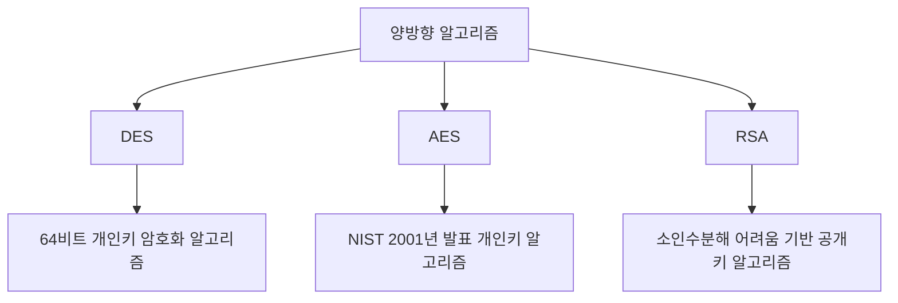
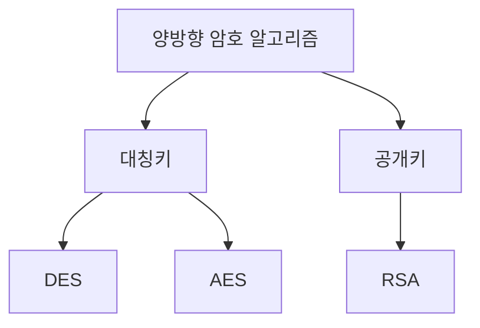

# 306 양방향 알고리즘 종류

작성 기준일: 2026-06-01
검색/보강일: 2026-06-04
기준 PDF: `/Users/nes0903/Documents/study/정보처리기사/핵심요약집_2026_정보처리기사필기핵심요약.pdf`
PDF 확인 위치: 43페이지 `306 양방향 알고리즘 종류`

## 한 줄 요약

- 양방향 암호 알고리즘은 복호화가 가능한 암호화 알고리즘이며, PDF는 DES, AES, RSA를 대표 종류로 제시한다.

## 한눈에 보는 구조

## PDF 기준 핵심

- DES(Data Encryption Standard): 1975년 미국 NBS에서 발표한 64비트의 개인키 암호화 알고리즘.
- AES(Advanced Encryption Standard): DES에 한계를 느낀 미국 표준 기술 연구소(NIST)가 2001년 발표한 개인키 암호화 알고리즘.
- RSA(Rivest Shamir Adleman): 큰 숫자를 소인수분해하기 어렵다는 것에 기반하여 만들어진 공개키 암호화 알고리즘.

## 개념 설명

- 양방향 암호화는 암호문을 다시 평문으로 복호화할 수 있는 암호화 방식이다.
- DES와 AES는 대칭키 계열이고, RSA는 공개키 계열이다.
- DES는 역사적으로 중요하지만 56비트 키 길이 한계 때문에 현대 보안에서는 AES가 널리 쓰인다.
- RSA는 큰 수의 소인수분해 어려움에 기반한 공개키 암호 알고리즘이다.

## 시험 포인트

- PDF의 연도와 기관 단서: DES는 1975년 NBS, AES는 2001년 NIST.
- DES와 AES는 개인키, RSA는 공개키로 구분한다.
- RSA 이름은 Rivest, Shamir, Adleman 세 사람의 이름이다.
- `양방향`은 복호화 가능하다는 뜻이며 해시와 구분한다.

## 헷갈리는 비교

| 알고리즘 | 종류 | 핵심 단서 |
|---|---|---|
| DES | 개인키/대칭키 | 1975, NBS, 64비트 |
| AES | 개인키/대칭키 | 2001, NIST, DES 한계 보완 |
| RSA | 공개키/비대칭키 | 소인수분해 어려움 |

## 예시 또는 암기 포인트

- 대량 데이터 암호화는 AES, 키 교환이나 전자서명 맥락은 RSA를 떠올리면 구분이 쉽다.
- 암기식: `DES/AES는 같은 키, RSA는 공개키`.

## 빠른 복습

- AES를 발표한 기관은? NIST.
- RSA의 기반 난제는? 큰 수의 소인수분해 어려움.
- 해시와 양방향 암호의 차이는? 해시는 복호화하지 않는다.

## 상세 보강

- 양방향 알고리즘은 암호화한 데이터를 다시 복호화할 수 있는 알고리즘이다.
- DES는 64비트 블록을 사용하는 오래된 대칭키 암호로, 현재는 보안 강도가 부족한 것으로 본다.
- AES는 DES의 한계를 보완하기 위해 표준화된 대표 대칭키 암호이다.
- RSA는 큰 수의 소인수분해가 어렵다는 성질을 기반으로 한 공개키 암호 알고리즘이다.
- 시험에서는 `AES = NIST가 2001년 발표한 개인키 암호화`, `RSA = 공개키`, `DES = 64비트 개인키 암호화`로 구분한다.

| 알고리즘 | 분류 | 핵심 단서 |
|---|---|---|
| DES | 대칭키 | 64비트, 오래된 표준 |
| AES | 대칭키 | DES 한계 보완, NIST 2001 |
| RSA | 공개키 | 소인수분해 어려움 |

## 참고 링크

- [NIST FIPS 197 - Advanced Encryption Standard](https://csrc.nist.gov/pubs/fips/197/final)
- [NIST SP 800-56B Rev. 2 - RSA-based Key Establishment](https://csrc.nist.gov/pubs/sp/800/56/b/r2/final)

<!-- study-links:start -->
## 관련 문서

- `해시`: [[정보처리기사/5과목 정보시스템 구축 관리/304 해시(Hash)/304 해시(Hash)|304 해시(Hash)]]
<!-- study-links:end -->
