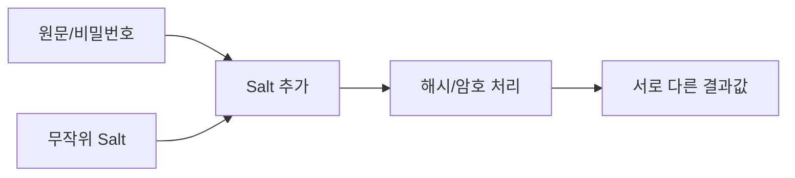
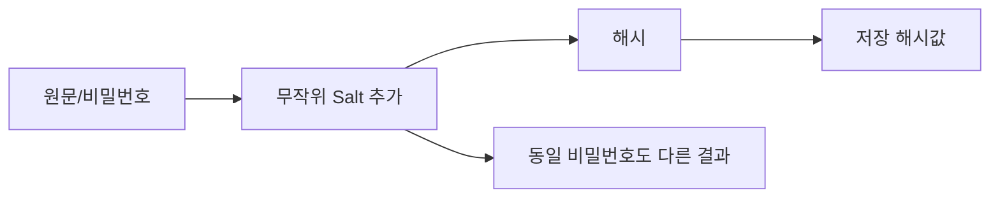

# 307 솔트(Salt)

작성 기준일: 2026-06-01
검색/보강일: 2026-06-04
기준 PDF: `/Users/nes0903/Documents/study/정보처리기사/핵심요약집_2026_정보처리기사필기핵심요약.pdf`
PDF 확인 위치: 43페이지 `307 솔트(Salt)`

## 한 줄 요약

- 솔트는 암호화나 해시 수행 전에 원문에 무작위 값을 덧붙여 같은 원문도 다른 결과가 나오게 하는 값이다.

## 한눈에 보는 구조

## PDF 기준 핵심

- 암호화를 수행하기에 앞서 원문에 무작위의 값을 덧붙이는 과정이다.
- `원문`, `무작위 값`, `덧붙임`이 핵심 단서이다.

## 개념 설명

- 비밀번호 저장에서는 솔트를 비밀번호에 더한 뒤 해시해 같은 비밀번호도 사용자마다 다른 해시값을 갖게 한다.
- 솔트는 레인보우 테이블 같은 사전 계산 공격을 어렵게 만든다.
- NIST SP 800-63B는 memorized secret 검증에서 salt를 사용하고 적절한 해싱 절차를 적용할 것을 설명한다.
- 솔트는 비밀일 필요는 없지만, 사용자별로 충분히 무작위이고 중복 가능성이 낮아야 한다.

## 시험 포인트

- `원문에 무작위 값 덧붙임`이라는 PDF 정의를 그대로 외운다.
- 솔트는 해시와 자주 연결된다.
- 솔트는 암호 키와 다르다. 키처럼 숨겨야만 하는 값이라기보다 해시 결과를 다양화하는 값이다.
- 같은 비밀번호라도 솔트가 다르면 해시값이 달라진다.

## 헷갈리는 비교

| 구분 | 솔트 | 해시 |
|---|---|---|
| 역할 | 원문에 덧붙이는 무작위 값 | 고정 길이 값으로 변환 |
| 목적 | 동일 원문 결과 다양화 | 무결성/검증 |
| 비밀성 | 보통 공개 가능 | 해시값은 저장 가능 |
| 시험 단서 | Salt, 무작위 값 | 일방향 함수 |

## 예시 또는 암기 포인트

- 같은 `password123`이라도 사용자 A의 솔트와 사용자 B의 솔트가 다르면 저장 해시값이 달라진다.
- 암기식: `Salt는 원문에 뿌리는 무작위 소금`.

## 빠른 복습

- 솔트란? 원문에 덧붙이는 무작위 값.
- 주된 효과는? 같은 원문도 다른 결과가 나오게 함.
- 해시와 관계는? 비밀번호 해시 전에 함께 쓰인다.

## 상세 보강

- 솔트는 비밀번호나 원문에 무작위 값을 덧붙인 뒤 해시해 같은 입력도 서로 다른 해시값을 갖게 만드는 기법이다.
- 같은 비밀번호를 쓰는 사용자들이 있어도 솔트가 다르면 저장 해시가 달라진다.
- 레인보우 테이블처럼 미리 계산된 해시 목록을 이용한 공격을 어렵게 만든다.
- 솔트는 비밀값일 필요는 없지만 사용자별로 충분히 무작위이고 고유해야 한다.
- 시험에서는 `암호화 전 원문에 무작위 값 추가`라는 PDF 표현을 그대로 기억한다.

| 구분 | 솔트 | 해시 |
|---|---|---|
| 역할 | 입력에 무작위성 추가 | 고정 길이 값 생성 |
| 목적 | 같은 원문도 다른 결과 | 무결성/저장값 확인 |
| 비밀 여부 | 보통 비밀 아님 | 해당 없음 |

## 참고 링크

- [NIST SP 800-63B - Digital Identity Guidelines](https://pages.nist.gov/800-63-4/sp800-63b.html)

<!-- study-links:start -->
## 관련 문서

- `무결성`: [[정보처리기사/3과목 데이터베이스 구축/115 무결성/115 무결성|115 무결성]]
- `해시`: [[정보처리기사/5과목 정보시스템 구축 관리/304 해시(Hash)/304 해시(Hash)|304 해시(Hash)]]
<!-- study-links:end -->
