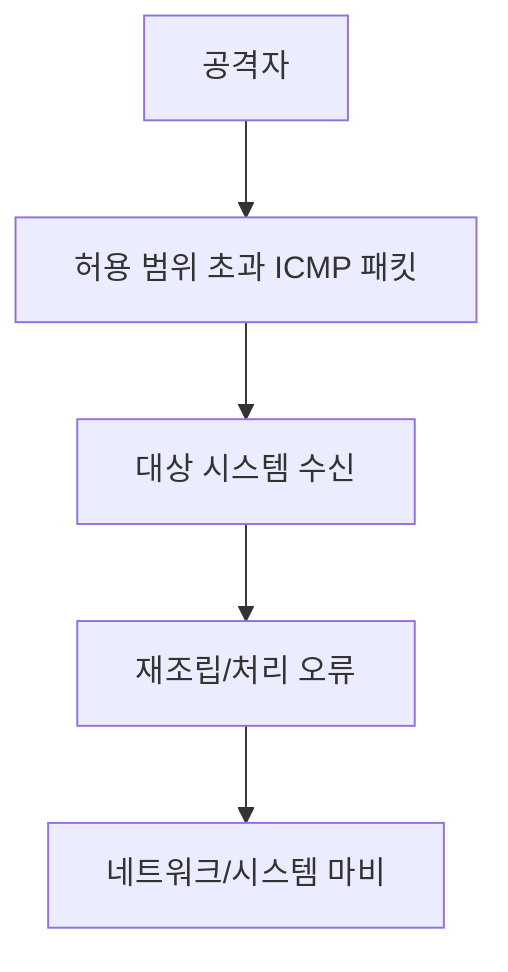
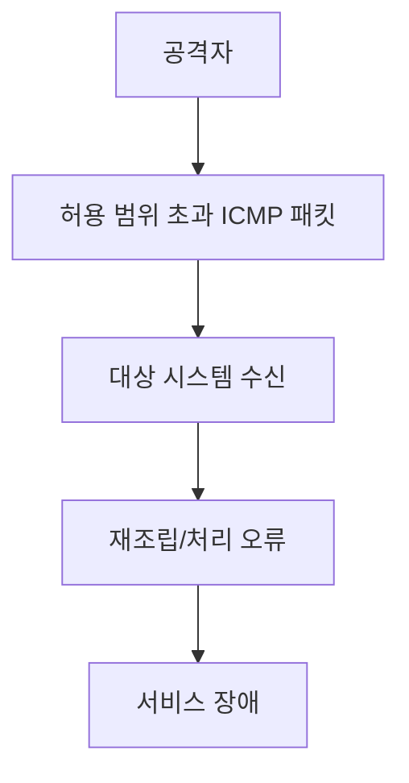

# 308 죽음의 핑(Ping of Death)

작성 기준일: 2026-06-01
검색/보강일: 2026-06-04
기준 PDF: `/Users/nes0903/Documents/study/정보처리기사/핵심요약집_2026_정보처리기사필기핵심요약.pdf`
PDF 확인 위치: 43페이지 `308 죽음의 핑(Ping of Death)`

## 한 줄 요약

- 죽음의 핑은 IP 허용 범위를 넘는 비정상적으로 큰 ICMP 패킷을 보내 대상 네트워크나 시스템을 마비시키는 DoS 공격이다.

## 한눈에 보는 구조

## PDF 기준 핵심

- Ping 명령을 전송할 때 ICMP 패킷의 크기를 인터넷 프로토콜 허용 범위 이상으로 전송한다.
- 공격 대상의 네트워크를 마비시키는 서비스 거부 공격 방법이다.
- `Ping`, `ICMP`, `허용 범위 이상`, `서비스 거부`가 핵심 단서이다.

## 개념 설명

- Ping은 ICMP Echo Request/Reply를 이용해 네트워크 연결 상태를 확인하는 명령이다.
- Ping of Death는 과거 시스템이 비정상적으로 큰 IP 패킷을 재조립하다가 오류를 일으키던 취약점을 악용했다.
- 현대 운영체제는 대부분 방어되어 있지만, 시험에서는 공격 원리와 ICMP 단서를 묻는다.
- CISA 취약점 정보에서도 Ping of Death는 oversized ICMP packet으로 인한 서비스 거부와 연결된다.

## 시험 포인트

- `ICMP 패킷 크기 초과`가 핵심이다.
- Ping Flood는 많은 ICMP 메시지로 자원을 소모시키고, Ping of Death는 비정상적으로 큰 패킷 크기가 핵심이다.
- DoS 공격 유형으로 분류한다.
- 스머핑도 ICMP를 악용하므로 차이를 비교해 둔다.

## 헷갈리는 비교

| 공격 | 핵심 | 시험 단서 |
|---|---|---|
| Ping of Death | 허용 범위 초과 ICMP 패킷 | oversized packet |
| Ping Flood | 매우 많은 ICMP 메시지 | flood, respond |
| Smurfing | IP/ICMP 특성 악용, 증폭 | 집중 전송 |

## 예시 또는 암기 포인트

- 단순히 Ping을 많이 보내는 것이 아니라, 비정상적으로 큰 ICMP 패킷을 보내는 것이 Ping of Death의 단서이다.
- 암기식: `죽음의 핑 = 크기가 죽인다`.

## 빠른 복습

- Ping of Death가 악용하는 프로토콜은? ICMP.
- 핵심 조건은? 패킷 크기가 허용 범위 이상.
- 공격 유형은? 서비스 거부(DoS).

## 상세 보강

- 죽음의 핑은 정상 허용 크기를 넘는 ICMP 패킷을 보내 대상 시스템의 네트워크 처리를 마비시키는 DoS 공격이다.
- 핵심은 단순히 ping을 보낸다는 것이 아니라 IP/ICMP 허용 범위를 넘는 비정상 크기를 이용한다는 점이다.
- 현대 시스템은 대부분 방어되어 있지만, 시험에서는 고전적 서비스 거부 공격 유형으로 출제된다.
- Ping Flood는 많은 ICMP 메시지를 보내는 양적 공격이고, Ping of Death는 비정상적으로 큰 패킷 크기가 단서이다.
- PDF의 `ICMP 패킷의 크기`, `프로토콜 허용 범위 이상`, `네트워크 마비`를 연결한다.

| 구분 | Ping of Death | Ping Flood |
|---|---|---|
| 핵심 | 비정상적으로 큰 ICMP | 매우 많은 ICMP |
| 피해 | 처리 오류/마비 | 자원 고갈 |
| 단서 | 허용 범위 이상 크기 | 응답으로 자원 소모 |

## 참고 링크

- [CISA CVE - Ping of Death](https://www.cisa.gov/news-events/bulletins/sb17-002)
- [Cloudflare - What is a Ping of Death attack?](https://www.cloudflare.com/learning/ddos/ping-of-death-ddos-attack/)

<!-- study-links:start -->
## 관련 문서

- `ping flood`: [[정보처리기사/5과목 정보시스템 구축 관리/312 Ping Flood/312 Ping Flood|312 Ping Flood]]
- `smurfing`: [[정보처리기사/5과목 정보시스템 구축 관리/309 SMURFING(스머핑)/309 SMURFING(스머핑)|309 SMURFING(스머핑)]]
<!-- study-links:end -->
