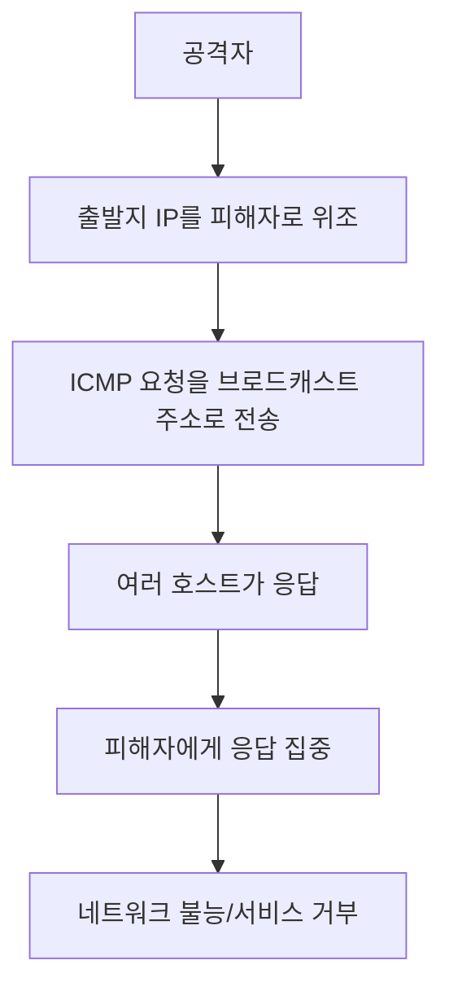
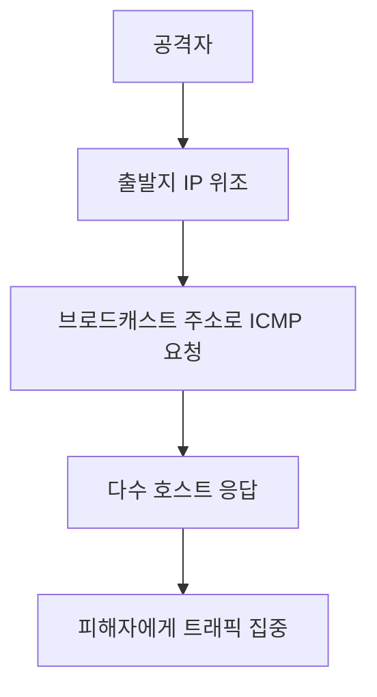

# 309 SMURFING(스머핑)

작성 기준일: 2026-06-01
검색/보강일: 2026-06-04
기준 PDF: `/Users/nes0903/Documents/study/정보처리기사/핵심요약집_2026_정보처리기사필기핵심요약.pdf`
PDF 확인 위치: 43페이지 `309 SMURFING(스머핑)`

## 한 줄 요약

- 스머핑은 IP나 ICMP 특성을 악용해 대량의 응답 트래픽을 피해자에게 집중시키는 서비스 거부 공격이다.

## 한눈에 보는 구조

## PDF 기준 핵심

- IP나 ICMP의 특성을 악용한다.
- 엄청난 양의 데이터를 한 사이트에 집중적으로 보낸다.
- 네트워크를 불능 상태로 만드는 공격 방법이다.

## 개념 설명

- 스머핑은 공격자가 피해자의 IP로 출발지를 위조한 ICMP Echo Request를 브로드캐스트 주소로 보내는 방식으로 설명된다.
- 브로드캐스트를 받은 여러 장치가 피해자에게 ICMP Echo Reply를 보내면 트래픽이 증폭된다.
- Cloudflare는 Smurf 공격을 ICMP 요청을 네트워크 브로드캐스트 주소로 보내고 출발지 IP를 피해자로 위조하는 공격으로 설명한다.
- 현재는 라우터가 directed broadcast를 차단하는 등 방어가 일반적이지만, 시험에서는 원리와 ICMP 단서가 중요하다.

## 시험 포인트

- `IP/ICMP 특성 악용`과 `한 사이트에 집중`이 핵심이다.
- Ping Flood는 공격자가 직접 많은 ICMP를 보내는 방식이고, Smurfing은 브로드캐스트 증폭과 IP 위조가 핵심이다.
- Ping of Death는 큰 ICMP 패킷 크기 초과가 핵심이다.
- DDoS와 같이 서비스 거부 계열로 묶어 비교한다.

## 헷갈리는 비교

| 공격 | 핵심 | ICMP 관련 단서 |
|---|---|---|
| Smurfing | IP 위조 + 브로드캐스트 증폭 | 응답 트래픽 집중 |
| Ping Flood | 많은 ICMP 요청 | 응답으로 자원 고갈 |
| Ping of Death | 허용 범위 초과 패킷 | 비정상 크기 |

## 예시 또는 암기 포인트

- 공격자가 피해자 주소를 가장해 방송망에 질문을 던지고, 여러 장치의 답장이 피해자에게 몰리는 구조로 이해한다.
- 암기식: `Smurfing = ICMP 증폭으로 몰아치기`.

## 빠른 복습

- 스머핑이 악용하는 것은? IP와 ICMP 특성.
- 트래픽은 어디에 집중되는가? 공격 대상 사이트.
- Ping of Death와 차이는? 크기 초과가 아니라 증폭/집중이다.

## 상세 보강

- 스머핑은 IP/ICMP 특성을 악용해 증폭된 응답 트래픽을 피해자에게 집중시키는 공격이다.
- 공격자는 피해자 IP로 출발지를 위조하고 브로드캐스트 주소로 ICMP 요청을 보내 다수의 응답이 피해자에게 가도록 만든다.
- 핵심은 `위조된 출발지`, `브로드캐스트`, `ICMP 응답 증폭`이다.
- Ping Flood가 공격자가 직접 많은 ICMP를 보내는 방식이라면, 스머핑은 여러 호스트의 응답을 이용해 트래픽을 증폭한다.
- PDF의 `엄청난 양의 데이터`, `한 사이트에 집중`, `네트워크 불능`이 핵심이다.

| 구분 | 스머핑 | DDoS |
|---|---|---|
| 방식 | ICMP와 브로드캐스트 증폭 | 여러 공격 지점에서 공격 |
| 핵심 단서 | IP/ICMP 특성 악용 | 분산된 공격 지점 |
| 피해 | 네트워크 불능 | 서비스 거부 |

## 참고 링크

- [Cloudflare - DNS amplification article with Smurf attack explanation](https://blog.cloudflare.com/deep-inside-a-dns-amplification-ddos-attack)
