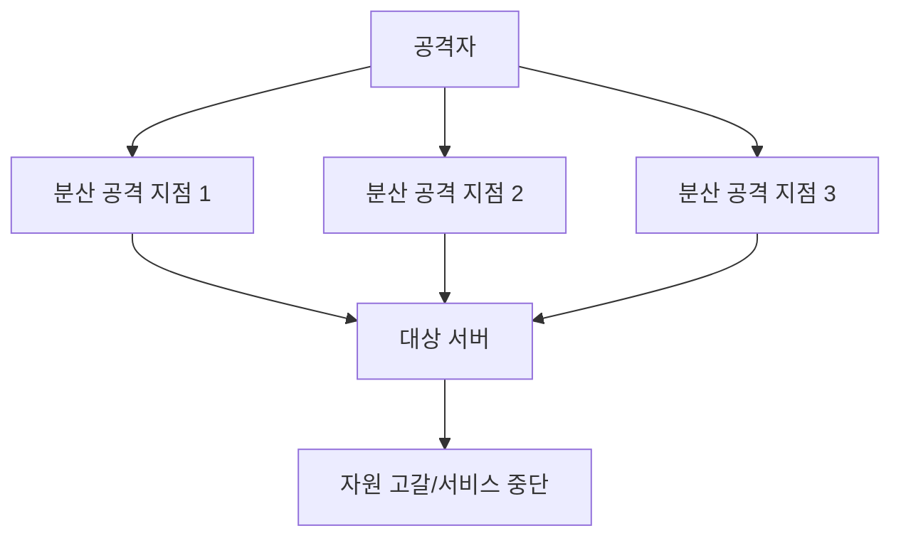
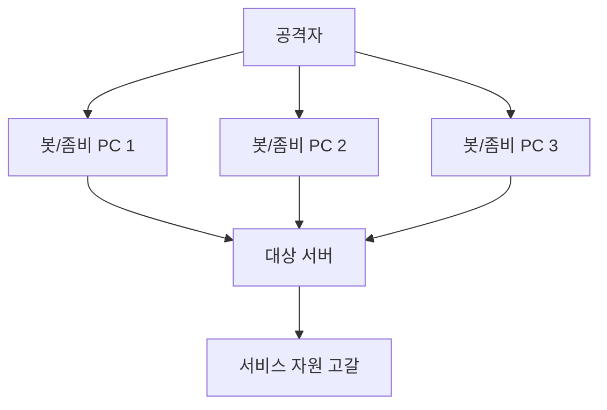

# 310 DDoS(Distributed Denial of Service, 분산 서비스 거부) 공격

작성 기준일: 2026-06-01
검색/보강일: 2026-06-04
기준 PDF: `/Users/nes0903/Documents/study/정보처리기사/핵심요약집_2026_정보처리기사필기핵심요약.pdf`
PDF 확인 위치: 43페이지 `310 DDoS(Distributed Denial of Service, 분산 서비스 거부) 공격`

## 한 줄 요약

- DDoS는 여러 공격 지점에서 한 대상 서버로 트래픽이나 요청을 집중시켜 정상 서비스를 방해하는 분산 서비스 거부 공격이다.

## 한눈에 보는 구조

## PDF 기준 핵심

- 여러 곳에 분산된 공격 지점에서 한 곳의 서버에 대해 분산 서비스 공격을 수행하는 것이다.
- 분산 서비스 공격용 툴의 종류: Trin00, TFN(Tribe Flooding Network), TFN2K, Stacheldraht 등.

## 개념 설명

- DDoS는 공격 트래픽이 여러 위치에서 오기 때문에 단일 출처 차단만으로 대응하기 어렵다.
- 봇넷, 감염된 장치, 클라우드 자원, 반사/증폭 기법이 공격에 이용될 수 있다.
- CISA와 Cloudflare 자료 모두 DDoS를 대량 트래픽으로 서비스 가용성을 방해하는 공격 범주로 설명한다.
- PDF의 도구명은 오래된 DDoS 도구지만 시험에서는 그대로 암기해야 한다.

## 시험 포인트

- `분산된 공격 지점`과 `한 곳의 서버`가 핵심이다.
- 도구명 `Trin00, TFN, TFN2K, Stacheldraht`를 PDF 그대로 외운다.
- 보안 3요소 중 가용성 침해와 연결된다.
- DoS는 단일 출처일 수 있고, DDoS는 분산 출처라는 차이를 기억한다.

## 헷갈리는 비교

| 구분 | DoS | DDoS |
|---|---|---|
| 공격 출처 | 하나 또는 소수 | 여러 분산 지점 |
| 대응 난이도 | 상대적으로 낮음 | 높음 |
| 핵심 피해 | 서비스 거부 | 분산 서비스 거부 |
| 시험 단서 | Denial | Distributed |

## 예시 또는 암기 포인트

- 감염된 수천 대 PC가 동시에 한 웹 서버에 요청을 보내 정상 사용자가 접속하지 못하게 만들면 DDoS이다.
- 암기식: `DDoS의 D는 Distributed`.

## 빠른 복습

- DDoS의 핵심은? 여러 공격 지점에서 한 서버 공격.
- PDF의 공격 툴 4가지는? Trin00, TFN, TFN2K, Stacheldraht.
- 침해되는 보안 요소는? 가용성.

## 상세 보강

- DDoS는 여러 공격 지점에서 동시에 트래픽이나 요청을 보내 대상 서비스의 자원을 고갈시키는 공격이다.
- 단일 DoS보다 차단이 어렵고, 봇넷이나 감염된 시스템을 이용할 수 있다.
- PDF의 공격 도구 이름 `Trin00`, `TFN`, `TFN2K`, `Stacheldraht`는 그대로 암기 대상이다.
- 피해는 서버 CPU, 메모리, 네트워크 대역폭, 애플리케이션 처리량 고갈로 나타난다.
- 대응은 트래픽 필터링, 레이트 리미팅, CDN/스크러빙 센터, 오토스케일링, 탐지 체계 등으로 정리한다.

| 구분 | DoS | DDoS |
|---|---|---|
| 공격 지점 | 단일 또는 소수 | 다수 분산 |
| 차단 난이도 | 상대적으로 낮음 | 높음 |
| 단서 | 서비스 거부 | 분산 서비스 거부 |

## 참고 링크

- [CISA - Understanding Denial-of-Service Attacks](https://www.cisa.gov/news-events/news/understanding-denial-service-attacks)
- [OSTI - Distributed Denial of Service Tools](https://www.osti.gov/biblio/792253)
