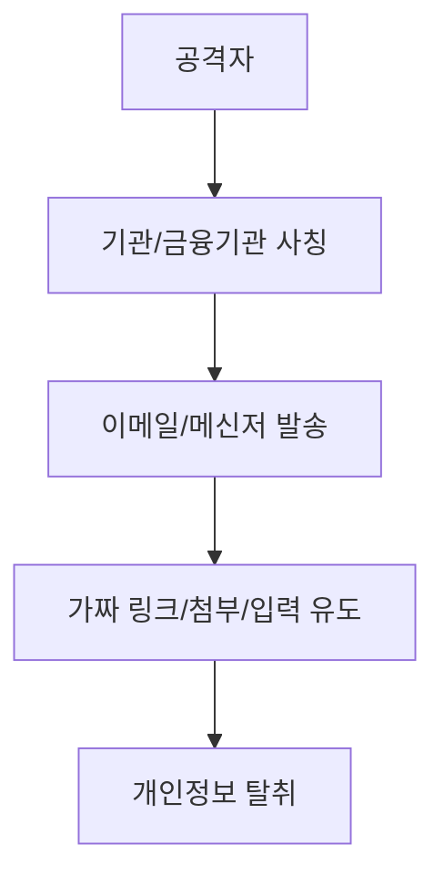
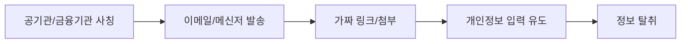

# 311 피싱(Phishing)

작성 기준일: 2026-06-01
검색/보강일: 2026-06-04
기준 PDF: `/Users/nes0903/Documents/study/정보처리기사/핵심요약집_2026_정보처리기사필기핵심요약.pdf`
PDF 확인 위치: 43페이지 `311 피싱(Phishing)`

## 한 줄 요약

- 피싱은 공공기관이나 금융기관 등을 사칭해 이메일·메신저로 사용자를 속이고 개인정보를 빼내는 사회공학 공격이다.

## 한눈에 보는 구조

## PDF 기준 핵심

- 이메일이나 메신저 등을 통해 공기관이나 금융 기관을 사칭한다.
- 개인 정보를 빼내는 기법이다.
- `사칭`, `이메일/메신저`, `개인정보 탈취`가 핵심 단서이다.

## 개념 설명

- 피싱은 기술 취약점보다 사람의 신뢰와 긴급함을 이용하는 사회공학 공격이다.
- 공격자는 로고, 도메인, 문구를 실제 기관처럼 꾸며 로그인 정보, 계좌 정보, 인증번호 입력을 유도한다.
- NIST는 피싱을 사용자를 속여 위조된 검증자나 서비스와 상호작용하게 하고 정보를 노출시키는 공격으로 설명한다.
- 대응은 발신자 확인, URL 확인, MFA 사용, 의심 메시지 신고, 링크 직접 접속 회피이다.

## 시험 포인트

- `기관 사칭 + 개인정보 탈취`가 핵심이다.
- 파밍은 DNS나 사이트 이동을 조작해 가짜 사이트로 유도하는 방식과 연결될 수 있다.
- 스미싱은 문자 메시지 기반 피싱으로 구분된다.
- 피싱은 보안 3요소 중 기밀성 침해로 연결된다.

## 헷갈리는 비교

| 구분 | 피싱 | 스미싱 | 파밍 |
|---|---|---|---|
| 주요 수단 | 이메일/메신저 | SMS 문자 | DNS/사이트 조작 |
| 핵심 | 사칭과 속임수 | 문자 링크 | 가짜 사이트 유도 |
| 피해 | 개인정보 탈취 | 개인정보/악성앱 | 계정/금융 정보 탈취 |

## 예시 또는 암기 포인트

- 은행을 사칭한 메일이 로그인 링크를 누르게 하고 계정 정보를 입력하게 하면 피싱이다.
- 암기식: `Phishing = 낚시처럼 개인정보를 낚음`.

## 빠른 복습

- 피싱의 수단은? 이메일, 메신저 등.
- 사칭 대상은? 공공기관, 금융기관 등.
- 목적은? 개인정보 탈취.

## 상세 보강

- 피싱은 신뢰할 만한 기관이나 사람을 사칭해 사용자가 개인정보나 인증 정보를 직접 제공하도록 속이는 사회공학 공격이다.
- 이메일, 문자, 메신저, 가짜 로그인 페이지, 악성 첨부파일 등 다양한 채널이 사용될 수 있다.
- 기술적 취약점보다 사용자의 신뢰와 부주의를 노리는 경우가 많다.
- PDF의 `공기관이나 금융 기관 사칭`, `개인 정보 탈취`가 핵심이다.
- 시험에서는 파밍, 스미싱, 보이스피싱과 비교될 수 있다. 피싱은 가장 넓은 사칭 기반 개인정보 탈취 개념이다.

| 구분 | 피싱 | 스미싱 | 파밍 |
|---|---|---|
| 채널 | 이메일/메신저 등 | 문자 메시지 | DNS/사이트 위조 |
| 목적 | 개인정보 탈취 | 개인정보/악성 앱 유도 | 가짜 사이트 접속 |
| 단서 | 기관 사칭 | SMS | 정상 주소처럼 보임 |

## 참고 링크

- [NIST CSRC Glossary - Phishing](https://csrc.nist.gov/glossary/term/phishing)
- [FBI - Spoofing and Phishing](https://www.fbi.gov/how-we-can-help-you/scams-and-safety/common-scams-and-crimes/spoofing-and-phishing)

<!-- study-links:start -->
## 관련 문서

- `dns`: [[DNS/DNS|DNS 상세 정리]]
<!-- study-links:end -->
