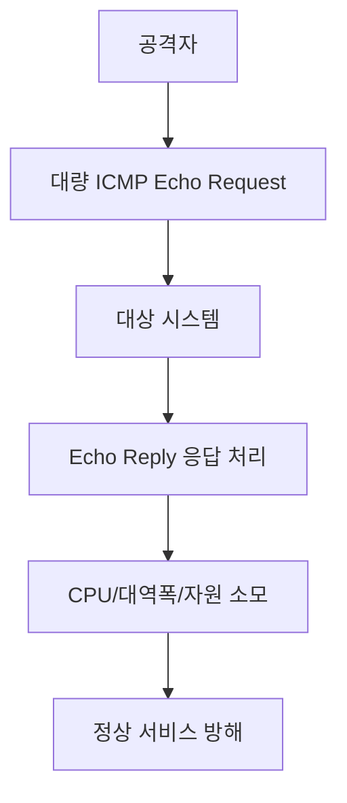
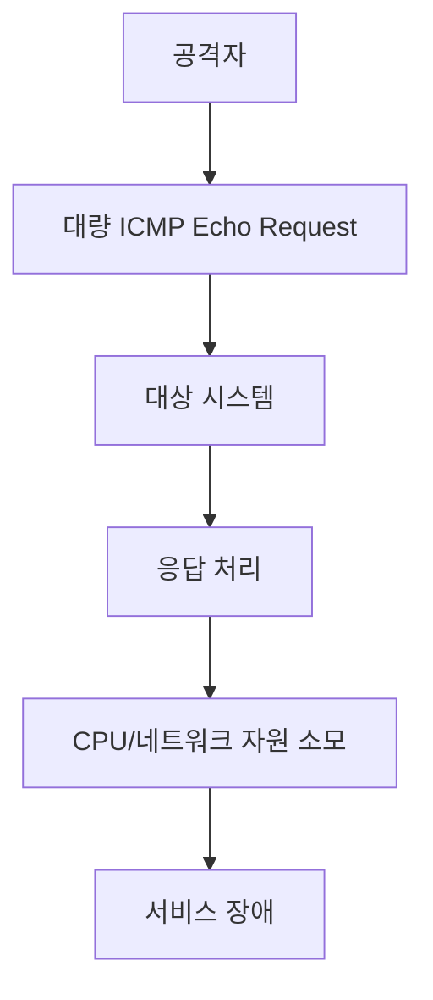

# 312 Ping Flood

작성 기준일: 2026-06-01
검색/보강일: 2026-06-04
기준 PDF: `/Users/nes0903/Documents/study/정보처리기사/핵심요약집_2026_정보처리기사필기핵심요약.pdf`
PDF 확인 위치: 43페이지 `312 Ping Flood`

## 한 줄 요약

- Ping Flood는 대량의 ICMP 메시지를 보내 응답 처리로 시스템 자원을 소모시켜 정상 동작을 방해하는 공격이다.

## 한눈에 보는 구조

## PDF 기준 핵심

- 매우 많은 ICMP 메시지를 보낸다.
- 이에 대한 응답(Respond)으로 시스템 자원을 모두 사용하게 한다.
- 시스템이 정상적으로 동작하지 못하도록 하는 공격 방법이다.

## 개념 설명

- Ping Flood는 ICMP Echo Request를 대량으로 보내 대상이 응답하느라 자원을 쓰게 만든다.
- Cloudflare는 Ping Flood를 대량의 ICMP echo request로 대상 장비를 압도해 정상 트래픽 접근을 어렵게 하는 DoS 공격으로 설명한다.
- 네트워크 대역폭, CPU, 응답 처리 큐 등이 고갈될 수 있다.
- 방어는 ICMP rate limiting, DDoS 방어, 필터링, Anycast 기반 분산 처리 등이 있다.

## 시험 포인트

- `매우 많은 ICMP 메시지`가 Ping Flood의 핵심이다.
- Ping of Death는 크기 초과, Ping Flood는 양이 핵심이다.
- Smurfing은 위조와 브로드캐스트 증폭이 핵심이다.
- 보안 3요소 중 가용성 침해와 연결된다.

## 헷갈리는 비교

| 공격 | 핵심 기준 | 결과 |
|---|---|---|
| Ping Flood | ICMP 메시지 양 | 자원 고갈 |
| Ping of Death | ICMP 패킷 크기 | 처리 오류/마비 |
| Smurfing | ICMP 증폭 | 피해자에게 응답 집중 |

## 예시 또는 암기 포인트

- 수많은 Ping 요청이 들어와 서버가 응답 처리에 자원을 소모하면 Ping Flood이다.
- 암기식: `Flood는 양으로 밀어붙인다`.

## 빠른 복습

- Ping Flood가 많이 보내는 것은? ICMP 메시지.
- 자원이 소모되는 이유는? 응답 처리 때문이다.
- Ping of Death와 차이는? 크기가 아니라 양이다.

## 상세 보강

- Ping Flood는 대상에게 매우 많은 ICMP 메시지를 보내 응답 처리로 시스템 자원을 소모시키는 공격이다.
- Ping of Death가 비정상 크기를 이용한다면, Ping Flood는 메시지 수와 트래픽 양이 핵심이다.
- 대량 요청으로 네트워크 대역폭, CPU, 커널 네트워크 처리 자원을 소모하게 만든다.
- PDF의 `매우 많은 ICMP 메시지`, `응답으로 시스템 자원 사용`, `정상 동작 불가`가 핵심이다.
- 시험에서는 ICMP 기반 DoS 공격의 세부 유형으로 구분한다.

| 구분 | 핵심 단서 |
|---|---|
| Ping Flood | 많은 ICMP 메시지 |
| Ping of Death | 허용 범위 초과 크기 |
| Smurfing | IP/ICMP 증폭과 브로드캐스트 |

## 참고 링크

- [Cloudflare - Ping ICMP Flood DDoS Attack](https://www.cloudflare.com/learning/ddos/ping-icmp-flood-ddos-attack/)
