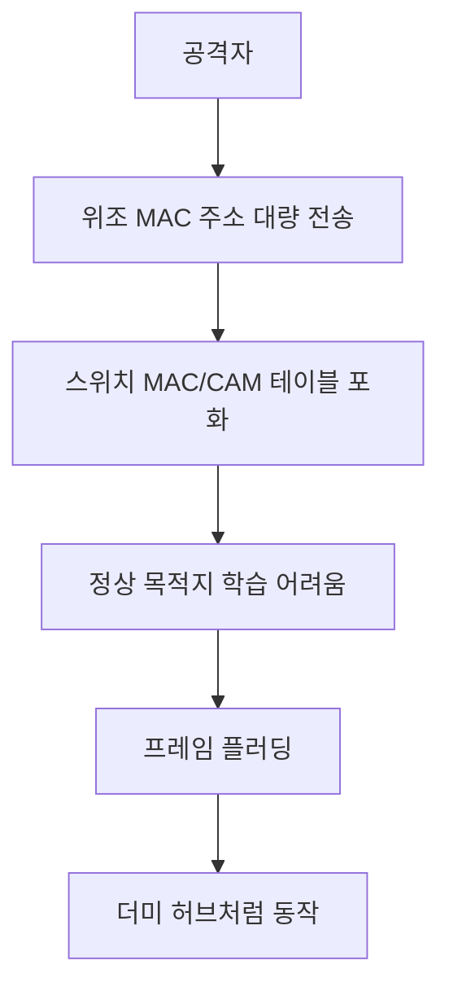
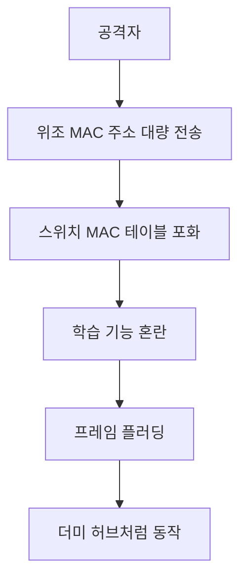

# 313 스위치 재밍(Switch Jamming)

작성 기준일: 2026-06-01
검색/보강일: 2026-06-04
기준 PDF: `/Users/nes0903/Documents/study/정보처리기사/핵심요약집_2026_정보처리기사필기핵심요약.pdf`
PDF 확인 위치: 43페이지 `313 스위치 재밍(Switch Jamming)`

## 한 줄 요약

- 스위치 재밍은 위조 MAC 주소를 대량으로 보내 스위치의 MAC 주소 테이블을 혼란시켜 허브처럼 플러딩하게 만드는 공격이다.

## 한눈에 보는 구조

## PDF 기준 핵심

- 위조된 매체 접근 제어(MAC) 주소를 지속해서 네트워크로 흘려보낸다.
- 스위치 MAC 주소 테이블의 저장 기능을 혼란시킨다.
- 더미 허브(Dummy Hub)처럼 작동하게 하는 공격이다.

## 개념 설명

- 스위치는 MAC 주소 테이블을 보고 목적지 포트로 프레임을 전달한다.
- 공격자가 많은 가짜 MAC 주소를 보내면 테이블이 포화되어 정상 학습이 어려워질 수 있다.
- 이때 스위치는 모르는 목적지 프레임을 여러 포트로 플러딩하여 허브와 비슷하게 동작할 수 있다.
- Cisco 자료도 MAC flooding이 CAM table을 채워 스위칭 동작을 방해하는 공격으로 설명한다.

## 시험 포인트

- `위조 MAC 주소`, `MAC 주소 테이블 혼란`, `더미 허브처럼 동작`이 핵심이다.
- 스위치 재밍은 L2 스위치의 학습 테이블을 노린다.
- ARP 스푸핑과 혼동하지 않는다. ARP 스푸핑은 IP-MAC 매핑 조작이고, 스위치 재밍은 MAC 테이블 포화가 중심이다.
- 대응은 포트 보안, MAC 주소 제한, 802.1X 등이 있다.

## 헷갈리는 비교

| 구분 | 스위치 재밍 | ARP 스푸핑 |
|---|---|---|
| 대상 | 스위치 MAC 테이블 | ARP 캐시 |
| 방식 | 위조 MAC 대량 전송 | IP-MAC 매핑 속임 |
| 결과 | 허브처럼 플러딩 | 중간자 공격 가능 |
| 시험 단서 | Dummy Hub | ARP |

## 예시 또는 암기 포인트

- 스위치가 너무 많은 가짜 MAC을 학습해 테이블이 꽉 차면, 목적지를 모르는 프레임을 여러 포트로 뿌리게 된다.
- 암기식: `재밍은 MAC 테이블을 막히게 한다`.

## 빠른 복습

- 스위치 재밍의 입력은? 위조 MAC 주소.
- 공격 대상 테이블은? MAC 주소 테이블 또는 CAM 테이블.
- 결과는? 더미 허브처럼 작동.

## 상세 보강

- 스위치 재밍은 위조 MAC 주소를 대량으로 보내 스위치의 MAC 주소 테이블을 가득 채우는 공격이다.
- 테이블이 포화되면 스위치가 목적지 포트를 정확히 찾지 못해 프레임을 여러 포트로 뿌릴 수 있다.
- 이때 스위치가 더미 허브처럼 동작해 트래픽 노출 위험이 커진다.
- PDF의 `위조된 MAC 주소`, `MAC 주소 테이블 혼란`, `더미 허브처럼 작동`이 핵심이다.
- 대응은 포트 보안, MAC 주소 수 제한, 동적 ARP 검사 같은 스위치 보안 설정과 연결된다.

| 구분 | 스위치 재밍 | ARP 스푸핑 |
|---|---|---|
| 대상 | 스위치 MAC 테이블 | ARP 캐시 |
| 방식 | 위조 MAC 대량 학습 | IP-MAC 매핑 위조 |
| 피해 | 플러딩, 트래픽 노출 | 중간자 공격 가능 |

## 참고 링크

- [Cisco - MAC CAM flooding attack discussion](https://www.cisco.com/c/en/us/td/docs/voice_ip_comm/cucm/srnd/collab10/collab10/security.pdf)

<!-- study-links:start -->
## 관련 문서

- `arp`: [[정보처리기사/4과목 프로그래밍 언어 활용/217 TCP IP 프로토콜 - ARP/217 TCP IP 프로토콜 - ARP|217 TCP/IP 프로토콜 - ARP]]
<!-- study-links:end -->
