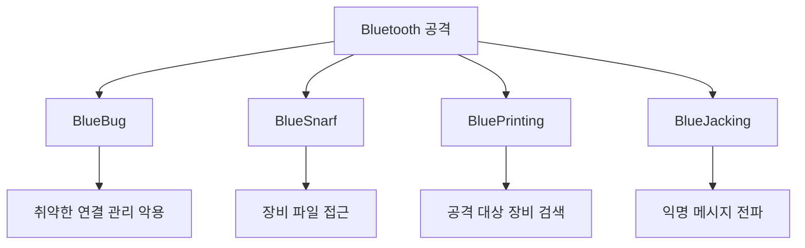
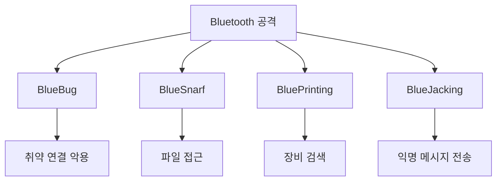

# 314 블루투스(Bluetooth) 관련 공격

작성 기준일: 2026-06-01
검색/보강일: 2026-06-04
기준 PDF: `/Users/nes0903/Documents/study/정보처리기사/핵심요약집_2026_정보처리기사필기핵심요약.pdf`
PDF 확인 위치: 43페이지 `314 블루투스(Bluetooth) 관련 공격`

## 한 줄 요약

- 블루투스 관련 공격은 취약한 연결 관리 악용, 파일 접근, 장비 검색, 스팸성 메시지 전송으로 구분해 외운다.

## 한눈에 보는 구조

## PDF 기준 핵심

- 블루버그(BlueBug): 블루투스 장비 사이의 취약한 연결 관리를 악용한 공격.
- 블루스나프(BlueSnarf): 블루투스의 취약점을 활용하여 장비의 파일에 접근하는 공격.
- 블루프린팅(BluePrinting): 공격 대상이 될 블루투스 장비를 검색하는 활동.
- 블루재킹(BlueJacking): 블루투스를 이용해 스팸처럼 메시지를 익명으로 퍼뜨리는 공격.

## 개념 설명

- BlueBug는 장치 제어, 통화, 메시지 접근 같은 더 깊은 권한 악용으로 설명되는 경우가 많다.
- BlueSnarf는 이름의 `snarf`처럼 데이터를 몰래 가져가는 공격으로 기억하면 쉽다.
- BluePrinting은 실제 공격 전에 주변 블루투스 장비의 정보와 취약 가능성을 식별하는 정찰 활동이다.
- BlueJacking은 보통 메시지 전송 중심이며, 정보 탈취보다는 스팸성 메시지와 연결된다.

## 시험 포인트

- PDF의 네 용어와 정의를 그대로 매칭한다.
- `파일 접근`은 BlueSnarf, `메시지 익명 전파`는 BlueJacking이다.
- `장비 검색`은 BluePrinting이다.
- `취약한 연결 관리 악용`은 BlueBug이다.

## 헷갈리는 비교

| 공격 | 핵심 행위 | 암기 단서 |
|---|---|---|
| BlueBug | 연결 관리 취약점 악용 | Bug |
| BlueSnarf | 파일/정보 접근 | Snarf = 훔쳐감 |
| BluePrinting | 공격 대상 장비 검색 | Printing = 목록화 |
| BlueJacking | 익명 메시지 전파 | Jacking = 메시지 장난/스팸 |

## 예시 또는 암기 포인트

- 주변 블루투스 장비를 먼저 찾아 목록화하면 BluePrinting이고, 그 장비 파일에 접근하면 BlueSnarf로 구분한다.
- 암기식: `Bug-연결, Snarf-파일, Printing-검색, Jacking-메시지`.

## 빠른 복습

- 블루투스 파일 접근 공격은? BlueSnarf.
- 공격 대상 장비 검색 활동은? BluePrinting.
- 메시지를 익명으로 퍼뜨리는 공격은? BlueJacking.

## 상세 보강

- 블루투스 관련 공격은 근거리 무선 연결의 취약한 페어링, 인증, 서비스 노출을 악용한다.
- BlueBug는 블루투스 장비 사이의 취약한 연결 관리를 악용한다.
- BlueSnarf는 장비의 파일이나 정보에 무단 접근하는 공격이다.
- BluePrinting은 공격 대상을 찾기 위해 블루투스 장비 정보를 탐색하는 활동이다.
- BlueJacking은 블루투스를 이용해 익명 메시지를 보내는 공격이다.

| 공격 | 핵심 단서 |
|---|---|
| BlueBug | 취약한 연결 관리 악용 |
| BlueSnarf | 장비 파일 접근 |
| BluePrinting | 공격 대상 장비 검색 |
| BlueJacking | 익명 메시지 전송 |

## 참고 링크

- [Bluesnarfing - Bluetooth information access overview](https://en.wikipedia.org/wiki/Bluesnarfing)
- [Bluejacking - Bluetooth message overview](https://en.wikipedia.org/wiki/Bluejacking)
- [Security Threats Analysis in Bluetooth-Enabled Mobile Devices](https://arxiv.org/abs/1206.1482)
