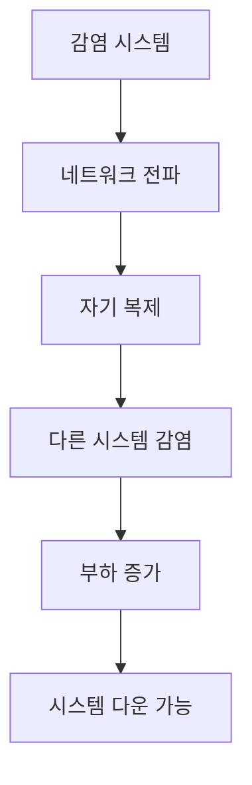

# 315 웜(Worm)

작성 기준일: 2026-06-01
검색/보강일: 2026-06-04
기준 PDF: `/Users/nes0903/Documents/study/정보처리기사/핵심요약집_2026_정보처리기사필기핵심요약.pdf`
PDF 확인 위치: 44페이지 `315 웜(Worm)`

## 한 줄 요약

- 웜은 네트워크를 통해 스스로 계속 복제되어 시스템 부하를 높이고 결국 시스템을 다운시킬 수 있는 악성코드이다.

## 한눈에 보는 구조

## PDF 기준 핵심

- 네트워크를 통해 연속적으로 자신을 복제한다.
- 시스템의 부하를 높인다.
- 결국 시스템을 다운시키는 바이러스의 일종이다.

## 개념 설명

- 웜은 사용자가 파일을 실행하지 않아도 네트워크 취약점을 통해 자동 전파될 수 있다.
- 자기 복제와 확산 속도가 특징이며, 네트워크 대역폭과 시스템 자원을 빠르게 소모한다.
- NIST는 악성코드에 바이러스, 웜, 트로이목마 등 코드 기반 개체가 포함될 수 있다고 설명한다.
- 바이러스가 보통 숙주 파일에 붙어 전파되는 것과 달리, 웜은 네트워크를 통한 독립적 전파가 핵심 단서이다.

## 시험 포인트

- `네트워크`, `연속 복제`, `부하 증가`, `시스템 다운`을 묶어 외운다.
- 웜은 가용성을 침해하는 공격으로 이어질 수 있다.
- 랜섬웨어는 파일 암호화와 금전 요구, 웜은 자기 복제와 전파가 핵심이다.
- 악성코드 분류 문제에서 바이러스, 웜, 트로이목마를 구분한다.

## 헷갈리는 비교

| 구분 | 웜 | 바이러스 | 랜섬웨어 |
|---|---|---|---|
| 핵심 | 네트워크 자기 복제 | 파일 감염 | 파일 암호화 후 금전 요구 |
| 전파 | 자동 전파 가능 | 숙주 파일 의존 | 감염 경로 다양 |
| 시험 단서 | 부하 증가, 다운 | 감염 | 암호화, 몸값 |

## 예시 또는 암기 포인트

- 취약한 서버를 찾아 자동으로 복제되어 수많은 서버에 퍼지는 악성코드를 웜으로 본다.
- 암기식: `Worm은 네트워크를 기어 다니며 복제`.

## 빠른 복습

- 웜의 전파 경로는? 네트워크.
- 핵심 행위는? 자기 복제.
- 대표 피해는? 시스템 부하 증가와 다운.

## 상세 보강

- 웜은 사용자 파일에 기생하기보다 네트워크를 통해 스스로 복제·전파되는 악성코드 유형이다.
- 전파 과정에서 네트워크 대역폭과 시스템 자원을 소모해 서비스 장애를 유발할 수 있다.
- 바이러스는 보통 파일 감염과 사용자 실행에 의존하는 경우가 많고, 웜은 네트워크 자기 전파성이 핵심이다.
- PDF의 `네트워크를 통해 연속적으로 자신을 복제`, `시스템 부하`, `시스템 다운`이 핵심이다.
- 대응은 패치 관리, 네트워크 분리, 악성 행위 탐지, 백신/EDR, 불필요 서비스 차단이다.

| 구분 | 웜 | 바이러스 |
|---|---|---|
| 전파 | 네트워크 자기 복제 | 파일 감염 중심 |
| 사용자 개입 | 상대적으로 적음 | 실행 필요할 수 있음 |
| 피해 | 네트워크/시스템 부하 | 파일 손상, 실행 감염 |

## 참고 링크

- [NIST CSRC Glossary - Malware](https://csrc.nist.gov/glossary/term/malware)
- [NIST CSRC Glossary - Worm](https://csrc.nist.gov/glossary/term/worm)
