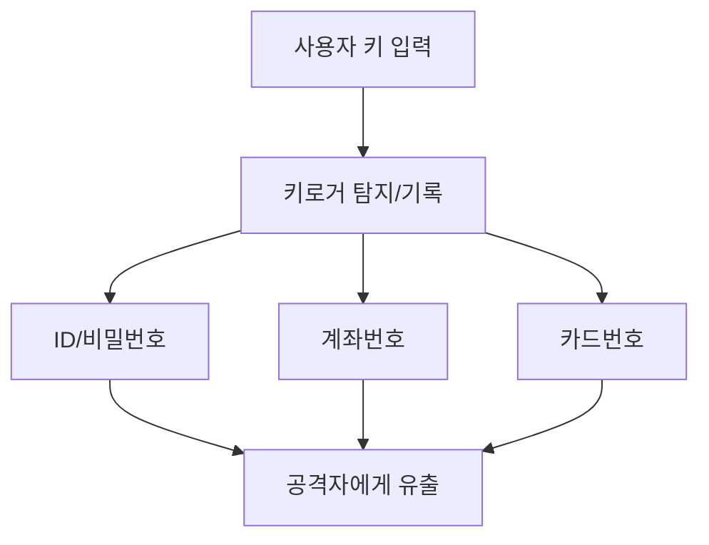
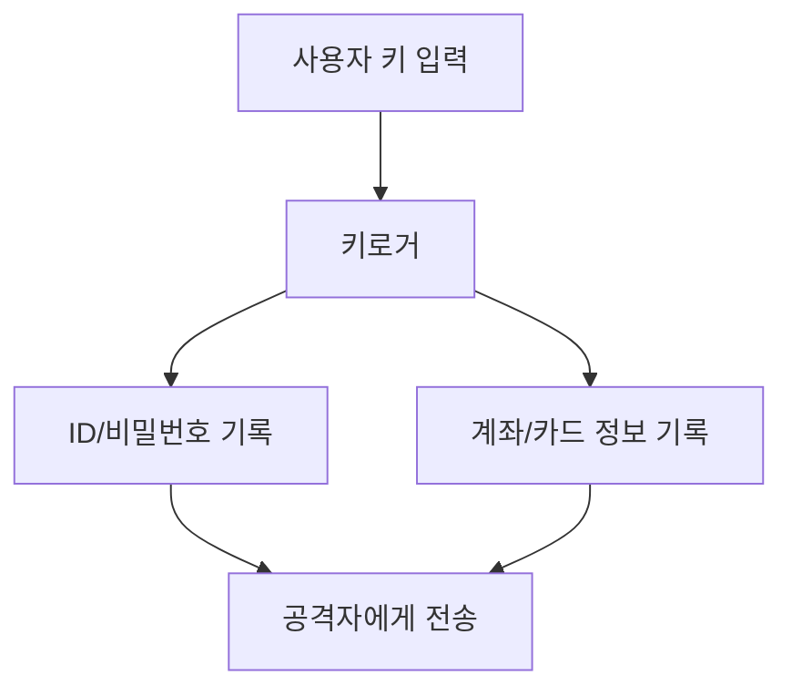

# 316 키로거 공격(Key Logger Attack)

작성 기준일: 2026-06-01
검색/보강일: 2026-06-04
기준 PDF: `/Users/nes0903/Documents/study/정보처리기사/핵심요약집_2026_정보처리기사필기핵심요약.pdf`
PDF 확인 위치: 44페이지 `316 키로거 공격(Key Logger Attack)`

## 한 줄 요약

- 키로거 공격은 사용자의 키보드 입력을 몰래 기록해 ID, 비밀번호, 계좌번호 같은 민감 정보를 탈취하는 공격이다.

## 한눈에 보는 구조

## PDF 기준 핵심

- 컴퓨터 사용자의 키보드 움직임을 탐지한다.
- ID, 패스워드, 계좌번호, 카드번호 등 개인의 중요한 정보를 몰래 빼가는 해킹 공격이다.

## 개념 설명

- 키로거는 소프트웨어 형태로 설치되거나 하드웨어 장치 형태로 연결될 수 있다.
- 사용자가 정상 사이트에 로그인하더라도 키 입력 자체를 기록하면 계정 정보가 노출될 수 있다.
- NIST 용어집도 key logger를 사용자의 키 입력을 기록하는 소프트웨어나 하드웨어로 다룬다.
- 대응은 악성코드 탐지, 보안 업데이트, MFA, 가상 키보드, 의심 장치 점검 등이 있다.

## 시험 포인트

- `키보드 움직임 탐지`가 핵심 단서이다.
- 탈취 정보로 ID, 패스워드, 계좌번호, 카드번호를 PDF 그대로 기억한다.
- 피싱은 사용자를 속여 입력하게 하고, 키로거는 입력 자체를 몰래 기록한다.
- MFA가 있으면 비밀번호 탈취만으로 계정 장악을 어렵게 할 수 있다.

## 헷갈리는 비교

| 구분 | 키로거 | 피싱 |
|---|---|---|
| 방식 | 키 입력 기록 | 사칭으로 입력 유도 |
| 피해 | 입력한 민감 정보 탈취 | 개인정보/인증 정보 탈취 |
| 단서 | keyboard, logger | email, messenger, spoof |

## 예시 또는 암기 포인트

- PC에 몰래 설치된 프로그램이 사용자가 입력한 인터넷뱅킹 비밀번호를 기록하면 키로거 공격이다.
- 암기식: `Key Logger = 키 입력 기록자`.

## 빠른 복습

- 키로거가 관찰하는 것은? 키보드 움직임/키 입력.
- 대표 탈취 정보는? ID, 패스워드, 계좌번호, 카드번호.
- 피싱과 차이는? 피싱은 속임수, 키로거는 입력 기록이다.

## 상세 보강

- 키로거는 사용자의 키보드 입력을 몰래 기록해 인증 정보나 금융 정보를 탈취하는 공격이다.
- 소프트웨어 악성코드 형태도 있고, 물리 장치 형태로 설치될 수도 있다.
- 피해 정보는 ID, 비밀번호, 계좌번호, 카드번호, 2차 인증 코드 등 사용자가 입력하는 값이다.
- 대응은 보안 소프트웨어, 키보드 보안, MFA, 피싱 주의, 물리 장치 점검 등이다.
- 시험에서는 `키보드 움직임 탐지`, `중요 정보 몰래 탈취`가 핵심 단서이다.

| 구분 | 키로거 | 피싱 |
|---|---|---|
| 방식 | 입력 자체 기록 | 사용자를 속여 입력 유도 |
| 대상 | 키보드 입력 | 개인정보/인증정보 |
| 단서 | Key Logger | 기관 사칭 |

## 참고 링크

- [NIST CSRC Glossary - Key Logger](https://csrc.nist.gov/glossary/term/key_logger)

<!-- study-links:start -->
## 관련 문서

- `피싱`: [[정보처리기사/5과목 정보시스템 구축 관리/311 피싱(Phishing)/311 피싱(Phishing)|311 피싱(Phishing)]]
<!-- study-links:end -->
