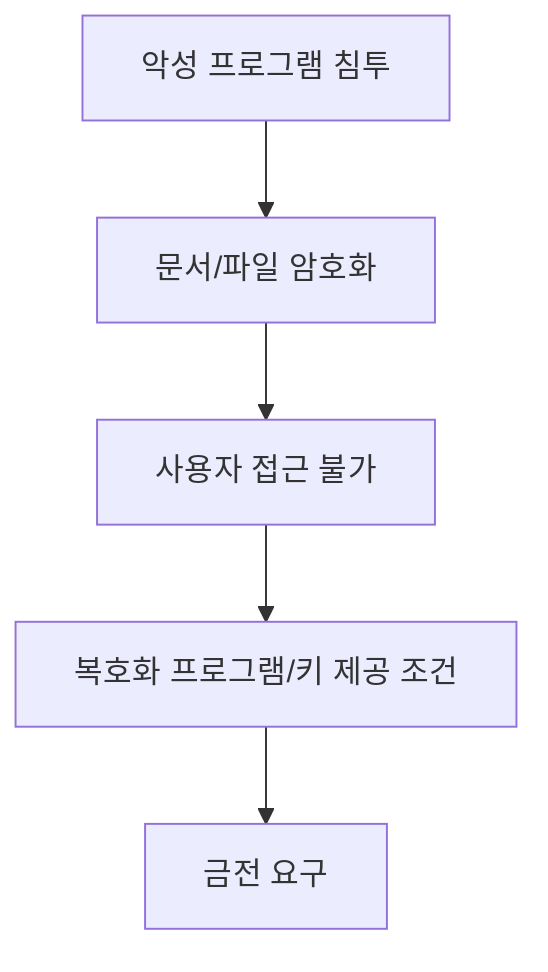
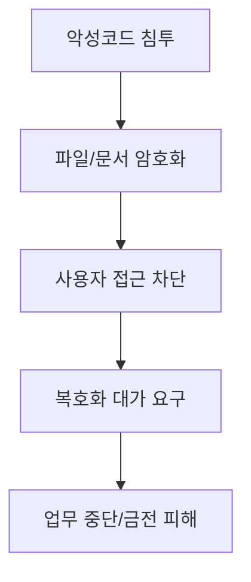

# 317 랜섬웨어(Ransomware)

작성 기준일: 2026-06-01
검색/보강일: 2026-06-04
기준 PDF: `/Users/nes0903/Documents/study/정보처리기사/핵심요약집_2026_정보처리기사필기핵심요약.pdf`
PDF 확인 위치: 44페이지 `317 랜섬웨어(Ransomware)`

## 한 줄 요약

- 랜섬웨어는 사용자 컴퓨터에 침투해 문서나 파일을 암호화하고, 복호화 조건으로 금전을 요구하는 악성 프로그램이다.

## 한눈에 보는 구조

## PDF 기준 핵심

- 인터넷 사용자의 컴퓨터에 잠입한다.
- 내부 문서나 파일 등을 암호화해 사용자가 열지 못하게 한다.
- 암호 해독용 프로그램의 전달을 조건으로 사용자에게 돈을 요구하기도 한다.

## 개념 설명

- 랜섬웨어는 ransom과 malware의 합성어로, 데이터 접근을 인질로 삼는 악성코드이다.
- 파일 암호화형, 화면 잠금형, 이중 갈취형 등으로 발전했다.
- CISA는 랜섬웨어를 중요한 사이버 위협으로 다루며 예방, 백업, 대응 계획의 중요성을 강조한다.
- 대응은 오프라인 백업, 패치, 이메일 보안, 권한 최소화, EDR, 침해 대응 훈련이다.

## 시험 포인트

- `파일 암호화 + 돈 요구`가 핵심이다.
- 웜은 자기 복제, 랜섬웨어는 암호화와 금전 요구로 구분한다.
- 보안 3요소 중 가용성과 기밀성 모두 침해될 수 있지만, 시험 정의는 파일을 열지 못하게 하는 점이 중심이다.
- 복호화 키를 제공한다는 보장이 없으므로 예방과 백업이 중요하다.

## 헷갈리는 비교

| 구분 | 랜섬웨어 | 웜 | 키로거 |
|---|---|---|
| 핵심 | 파일 암호화와 금전 요구 | 자기 복제 | 키 입력 기록 |
| 피해 | 접근 불가, 금전 피해 | 시스템 부하 | 정보 탈취 |
| 단서 | ransom | network replication | keyboard |

## 예시 또는 암기 포인트

- 문서가 모두 암호화되어 열리지 않고 복호화 비용을 요구하는 화면이 뜨면 랜섬웨어 공격이다.
- 암기식: `Ransomware = 파일을 인질로 몸값 요구`.

## 빠른 복습

- 랜섬웨어가 하는 핵심 행위는? 파일 암호화.
- 공격자가 요구하는 것은? 금전.
- 대표 예방책은? 백업과 보안 업데이트.

## 상세 보강

- 랜섬웨어는 사용자 파일이나 시스템을 암호화해 접근하지 못하게 하고 금전을 요구하는 악성코드이다.
- 최근에는 파일 암호화뿐 아니라 데이터 유출을 빌미로 협박하는 형태도 같이 나타난다.
- 피해를 줄이려면 정기 백업, 백업망 분리, 패치, 이메일 첨부 주의, 최소 권한, EDR 탐지가 중요하다.
- PDF의 `내부 문서나 파일 암호화`, `열지 못하게 함`, `암호 해독용 프로그램 전달 조건으로 돈 요구`가 핵심이다.
- 시험에서는 랜섬웨어를 웜과 구분한다. 웜은 자기 복제 전파, 랜섬웨어는 암호화와 금전 요구가 핵심이다.

| 구분 | 랜섬웨어 | 웜 |
|---|---|---|
| 핵심 피해 | 파일 암호화, 금전 요구 | 자기 복제로 부하 증가 |
| 목적 | 몸값 요구 | 전파와 장애 |
| 대응 | 백업, 복구 계획 | 패치, 확산 차단 |

## 참고 링크

- [CISA - Stop Ransomware](https://www.cisa.gov/stopransomware)
- [NIST CSRC Glossary - Ransomware](https://csrc.nist.gov/glossary/term/ransomware)
