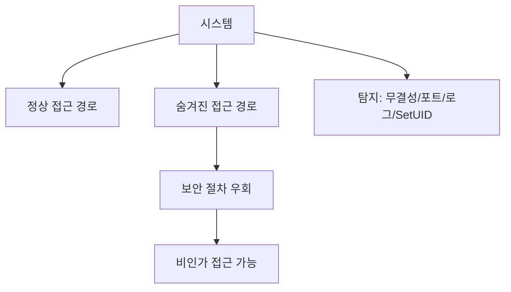
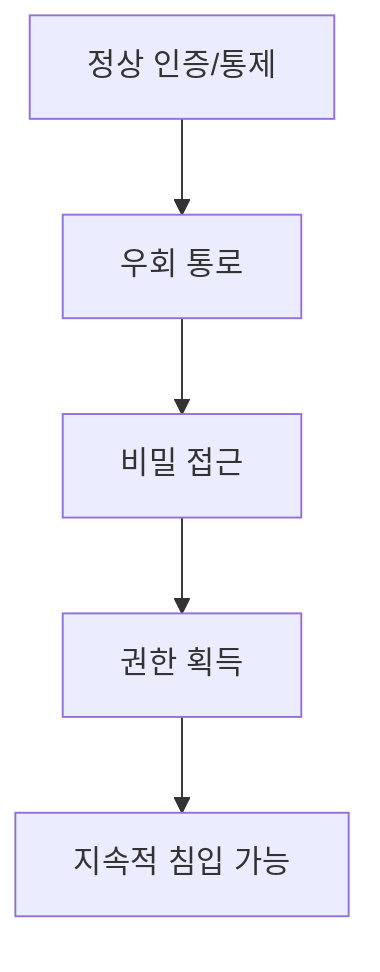

# 318 백도어(Back Door, Trap Door)

작성 기준일: 2026-06-01
검색/보강일: 2026-06-04
기준 PDF: `/Users/nes0903/Documents/study/정보처리기사/핵심요약집_2026_정보처리기사필기핵심요약.pdf`
PDF 확인 위치: 44페이지 `318 백도어(Back Door, Trap Door)`

## 한 줄 요약

- 백도어는 정상 인증이나 보안 절차를 우회해 시스템에 접근할 수 있도록 숨겨 둔 비밀 통로이다.

## 한눈에 보는 구조

## PDF 기준 핵심

- 시스템 설계자가 액세스 편의를 위해 시스템 보안을 제거하여 만들어놓은 비밀 통로이다.
- 백도어 탐지 방법: 무결성 검사, 열린 포트 확인, 로그 분석, SetUID 파일 검사 등.

## 개념 설명

- 백도어는 개발·운영 편의를 위해 만들어진 숨은 접근 경로가 악용되거나, 공격자가 침투 후 재접속을 위해 설치할 수 있다.
- 정상 인증 절차를 우회하므로 접근통제와 감사 체계를 무력화할 수 있다.
- NIST는 backdoor를 정상 인증 절차를 우회하는 숨겨진 기능이나 메커니즘으로 설명한다.
- 탐지는 파일 변경, 비정상 포트, 이상 로그, 권한 상승 파일을 확인하는 방식으로 수행한다.

## 시험 포인트

- `비밀 통로`, `보안 제거`, `Trap Door`가 핵심 단서이다.
- 탐지 방법 4가지를 PDF 그대로 외운다.
- SetUID 파일 검사는 UNIX/Linux 권한 상승 위험과 연결된다.
- 백도어는 단순 취약점이 아니라 의도적 우회 경로라는 점이 중요하다.

## 헷갈리는 비교

| 구분 | 백도어 | 취약점 |
|---|---|---|
| 성격 | 숨겨진 접근 통로 | 보안 결함 |
| 생성 | 의도적으로 남기거나 공격자가 설치 | 설계/구현 실수 |
| 단서 | Trap Door | weakness |
| 탐지 | 무결성, 포트, 로그, SetUID | 취약점 진단 |

## 예시 또는 암기 포인트

- 특정 포트로 접속하면 인증 없이 관리자 셸이 열리는 숨은 기능은 백도어이다.
- 암기식: `Back Door = 정문 아닌 뒷문`.

## 빠른 복습

- 백도어의 다른 이름은? Trap Door.
- PDF 탐지 방법은? 무결성 검사, 열린 포트 확인, 로그 분석, SetUID 파일 검사.
- 핵심 위험은? 정상 보안 절차 우회.

## 상세 보강

- 백도어는 정상 인증이나 보안 절차를 우회해 시스템에 접근할 수 있는 숨겨진 통로이다.
- 개발·운영 편의를 위해 의도적으로 남겨졌거나, 공격자가 침투 후 지속 접근을 위해 설치할 수 있다.
- PDF의 백도어 탐지 방법은 `무결성 검사`, `열린 포트 확인`, `로그 분석`, `SetUID 파일 검사`이다.
- Trap Door는 백도어와 비슷하게 숨겨진 접근 경로를 뜻하는 표현으로 같이 출제된다.
- 시험에서는 백도어를 단순 취약점이 아니라 비밀 접근 통로로 이해한다.

| 탐지 방법 | 확인 내용 |
|---|---|
| 무결성 검사 | 파일 변조 여부 |
| 열린 포트 확인 | 비정상 서비스 대기 |
| 로그 분석 | 의심 접속 흔적 |
| SetUID 파일 검사 | 권한 상승 가능 파일 |

## 참고 링크

- [NIST CSRC Glossary - Backdoor](https://csrc.nist.gov/glossary/term/backdoor)

<!-- study-links:start -->
## 관련 문서

- `unix`: [[정보처리기사/4과목 프로그래밍 언어 활용/197 UNIX의 특징/197 UNIX의 특징|197 UNIX의 특징]]
- `무결성`: [[정보처리기사/3과목 데이터베이스 구축/115 무결성/115 무결성|115 무결성]]
<!-- study-links:end -->
