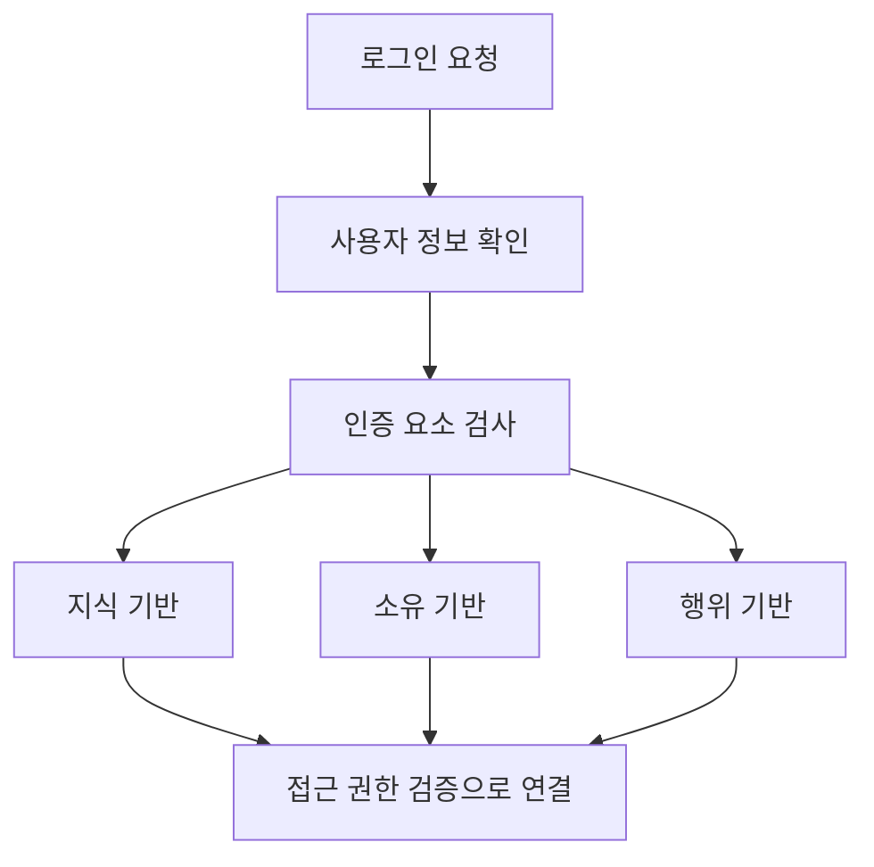
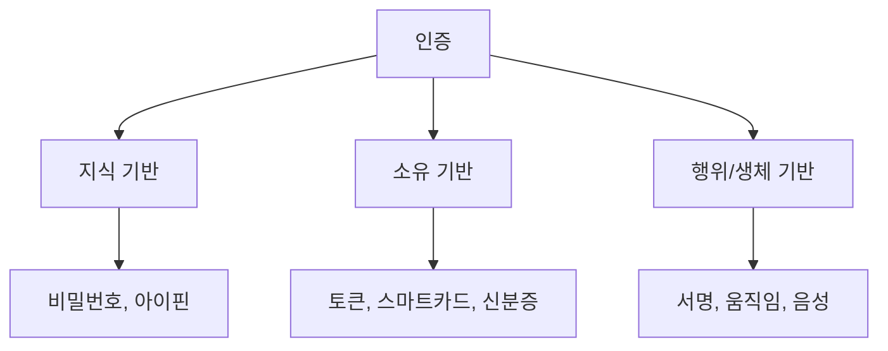

# 319 인증(認證, Authentication)

작성 기준일: 2026-06-01
검색/보강일: 2026-06-04
기준 PDF: `/Users/nes0903/Documents/study/정보처리기사/핵심요약집_2026_정보처리기사필기핵심요약.pdf`
PDF 확인 위치: 44페이지 `319 인증(認證, Authentication)`

## 한 줄 요약

- 인증은 접근을 요청한 사용자가 누구인지 확인하고, 접근 권한 검증의 출발점이 되는 보안 절차이다.

## 한눈에 보는 구조

## PDF 기준 핵심

- 로그인을 요청한 사용자의 정보를 확인하고 접근 권한을 검증하는 보안 절차이다.
- 인증 유형:
- 지식 기반 인증: 고정된 패스워드, 아이핀 등.
- 소유 기반 인증: 신분증, 토큰, 스마트카드 등.
- 행위 기반 인증: 서명, 움직임, 음성 등.

## 개념 설명

- 인증(Authentication)은 사용자가 주장하는 신원이 맞는지 확인하는 절차이다.
- 인가(Authorization)는 인증된 사용자가 특정 자원에 접근할 권한이 있는지 판단하는 절차이다.
- NIST SP 800-63B는 다양한 인증자와 인증 보증 수준을 다루며, 지식·소유·생체/행위 기반 요소를 조합한 다중 인증 개념과 연결된다.
- 정보처리기사에서는 PDF의 세 유형과 예시를 우선 외운다.

## 시험 포인트

- 인증과 인가를 구분한다. 인증은 신원 확인, 인가는 권한 부여이다.
- 지식 기반은 `아는 것`, 소유 기반은 `가진 것`, 행위 기반은 `하는 것`으로 외운다.
- 패스워드는 지식 기반, 스마트카드는 소유 기반이다.
- 서명, 움직임, 음성은 PDF 기준 행위 기반으로 정리한다.

## 헷갈리는 비교

| 유형 | 의미 | PDF 예 |
|---|---|---|
| 지식 기반 | 사용자가 아는 정보 | 고정 패스워드, 아이핀 |
| 소유 기반 | 사용자가 가진 물건 | 신분증, 토큰, 스마트카드 |
| 행위 기반 | 사용자 행위 특성 | 서명, 움직임, 음성 |

## 예시 또는 암기 포인트

- 비밀번호와 스마트카드를 함께 요구하면 지식 기반과 소유 기반을 결합한 다중 인증이다.
- 암기식: `인증 요소 = 아는 것, 가진 것, 하는 것`.

## 빠른 복습

- 인증이 확인하는 것은? 사용자의 신원 정보.
- 지식 기반 예는? 패스워드, 아이핀.
- 소유 기반 예는? 토큰, 스마트카드.

## 상세 보강

- 인증은 사용자가 주장하는 신원이 실제인지 확인하는 절차이다.
- 인가는 인증 후 해당 사용자가 어떤 자원에 어떤 행위를 할 수 있는지 결정하는 절차이다.
- PDF의 인증 유형은 지식 기반, 소유 기반, 행위 기반으로 정리된다.
- 다중 인증(MFA)은 서로 다른 인증 요소를 결합해 한 요소가 유출되어도 보안을 높이는 방식이다.
- 시험에서는 `Authentication = 인증`, `Authorization = 인가`를 구분한다.

| 유형 | 의미 | 예 |
|---|---|---|
| 지식 기반 | 사용자가 아는 것 | 비밀번호, 아이핀 |
| 소유 기반 | 사용자가 가진 것 | 토큰, 스마트카드 |
| 행위 기반 | 사용자 특성/행동 | 서명, 움직임, 음성 |

## 참고 링크

- [NIST SP 800-63B - Authentication and Lifecycle Management](https://pages.nist.gov/800-63-4/sp800-63b.html)
