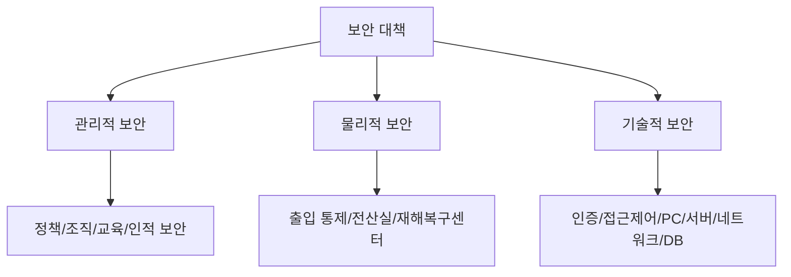
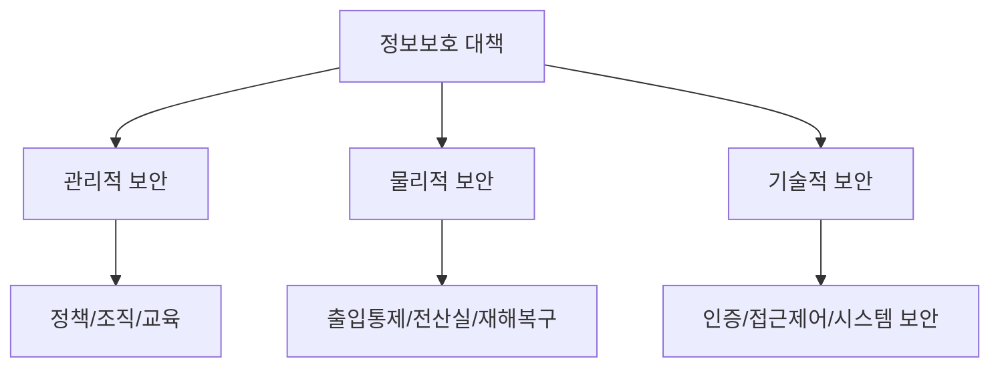

# 320 관리적/물리적/기술적 보안

작성 기준일: 2026-06-01
검색/보강일: 2026-06-04
기준 PDF: `/Users/nes0903/Documents/study/정보처리기사/핵심요약집_2026_정보처리기사필기핵심요약.pdf`
PDF 확인 위치: 44페이지 `320 관리적/물리적/기술적 보안`

## 한 줄 요약

- 보안 대책은 정책·조직·교육 중심의 관리적 보안, 시설·출입 중심의 물리적 보안, 시스템·네트워크·데이터 중심의 기술적 보안으로 나뉜다.

## 한눈에 보는 구조

## PDF 기준 핵심

- 관리적 보안: 정보보호 정책, 정보보호 조직, 정보자산 분류, 정보보호 교육 및 훈련, 인적 보안, 업무 연속성 관리 등의 정의.
- 물리적 보안: 건물 및 사무실 출입 통제 지침, 전산실 관리 지침, 정보 시스템 보호 설치 및 관리지침, 재해 복구 센터 운영 등의 정의.
- 기술적 보안: 사용자 인증, 접근 제어, PC, 서버, 네트워크, 응용 프로그램, 데이터(DB) 등의 보안지침 정의.

## 개념 설명

- 관리적 보안은 사람이 보안을 어떻게 운영하고 책임질지 정하는 정책과 절차 중심이다.
- 물리적 보안은 시설과 장비를 실제 침입, 재해, 환경 위험으로부터 보호한다.
- 기술적 보안은 시스템 자체의 인증, 접근 제어, 암호화, 로그, 네트워크 보호 기술을 적용한다.
- NIST 보안 통제도 관리, 물리, 기술적 성격의 통제를 조합해 정보 시스템을 보호하는 관점과 연결된다.

## 시험 포인트

- 보안 분류의 예시를 서로 바꿔 내는 문제가 많다.
- 정보보호 정책과 교육은 관리적 보안이다.
- 출입 통제와 전산실 관리는 물리적 보안이다.
- 인증, 접근 제어, 서버/네트워크/DB 보안은 기술적 보안이다.

## 헷갈리는 비교

| 구분 | 핵심 | PDF 예 |
|---|---|---|
| 관리적 보안 | 정책과 조직 | 정책, 조직, 교육, 인적 보안 |
| 물리적 보안 | 시설과 출입 | 건물 출입, 전산실, DR 센터 |
| 기술적 보안 | 시스템 통제 | 인증, 접근 제어, PC/서버/DB |

## 예시 또는 암기 포인트

- 서버실 출입문 잠금은 물리적 보안, 서버 로그인 MFA는 기술적 보안, 보안 교육은 관리적 보안이다.
- 암기식: `관리=정책, 물리=시설, 기술=시스템`.

## 빠른 복습

- 정보보호 교육은 어느 보안인가? 관리적 보안.
- 전산실 출입 통제는? 물리적 보안.
- 접근 제어는? 기술적 보안.

## 상세 보강

- 관리적 보안은 정책, 조직, 자산 분류, 교육, 인적 보안, 업무 연속성처럼 사람과 절차 중심 통제이다.
- 물리적 보안은 건물, 사무실, 전산실, 장비, 재해복구센터 같은 물리 환경을 보호하는 통제이다.
- 기술적 보안은 사용자 인증, 접근 제어, PC·서버·네트워크·애플리케이션·DB 보안처럼 기술 수단을 이용한 통제이다.
- 시험에서는 예시가 어떤 분류에 속하는지 묻는 경우가 많다.
- `정책/교육 = 관리적`, `출입/전산실 = 물리적`, `인증/암호화/방화벽 = 기술적`으로 빠르게 구분한다.

| 구분 | 중심 | 예 |
|---|---|---|
| 관리적 | 정책과 절차 | 보안 정책, 교육, 조직 |
| 물리적 | 시설과 장비 | 출입 통제, 전산실 관리 |
| 기술적 | 시스템과 기술 | 인증, 접근 제어, 네트워크 보안 |

## 참고 링크

- [NIST CSRC Glossary - Technical Controls](https://csrc.nist.gov/glossary/term/Technical_Controls)
- [NIST SP 800-53 Rev. 5](https://csrc.nist.gov/pubs/sp/800/53/r5/upd1/final)
