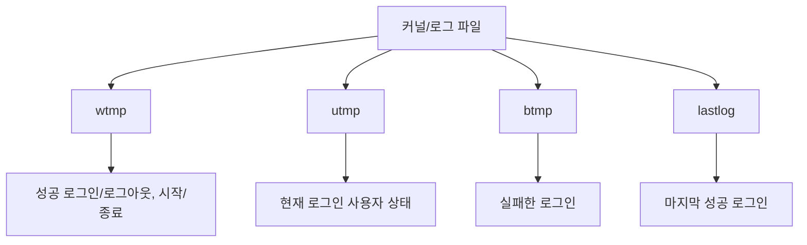
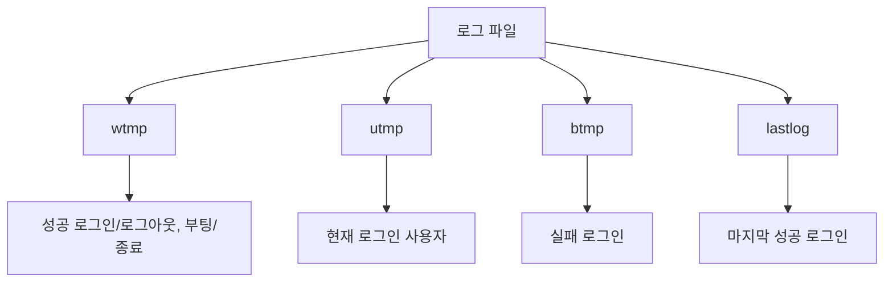

# 321 커널 로그의 종류

작성 기준일: 2026-06-01
검색/보강일: 2026-06-04
기준 PDF: `/Users/nes0903/Documents/study/정보처리기사/핵심요약집_2026_정보처리기사필기핵심요약.pdf`
PDF 확인 위치: 44페이지 `321 커널 로그의 종류`

## 한 줄 요약

- 커널 로그 종류는 성공 로그인 이력의 wtmp, 현재 로그인 상태의 utmp, 실패 로그인의 btmp, 마지막 성공 로그인의 lastlog로 구분한다.

## 한눈에 보는 구조

## PDF 기준 핵심

- wtmp: 성공한 로그인/로그아웃과 시스템의 시작/종료 시간에 대한 로그.
- utmp: 현재 로그인한 사용자의 상태에 대한 로그.
- btmp: 실패한 로그인에 대한 로그.
- lastlog: 마지막으로 성공한 로그인에 대한 로그.

## 개념 설명

- UNIX/Linux 계열 시스템은 로그인 상태와 이력을 여러 파일에 기록한다.
- `utmp`는 현재 세션 정보를, `wtmp`는 로그인/로그아웃 이력을, `lastlog`는 사용자별 마지막 로그인 정보를 다룬다.
- Linux man page도 wtmp가 모든 로그인과 로그아웃을 기록한다고 설명한다.
- btmp는 실패 로그인 이력을 확인하는 데 사용되며, 무차별 대입 공격 탐지에 도움이 된다.

## 시험 포인트

- `u = 현재`, `w = 성공한 이력`, `b = 실패`, `lastlog = 마지막 성공`으로 외운다.
- wtmp와 lastlog를 혼동하지 않는다. wtmp는 성공 로그인/로그아웃 전체 이력, lastlog는 마지막 성공 로그인이다.
- 보안 점검에서는 실패 로그인 btmp와 열린 포트, 로그 분석이 함께 나올 수 있다.
- 커널 로그라는 제목이지만 실제로는 로그인/시스템 이력 파일명을 구분하는 문제로 자주 출제된다.

## 헷갈리는 비교

| 로그 | 기록 내용 | 암기 단서 |
|---|---|---|
| wtmp | 성공 로그인/로그아웃, 시스템 시작/종료 | who/when history |
| utmp | 현재 로그인 상태 | now users |
| btmp | 실패한 로그인 | bad login |
| lastlog | 마지막 성공 로그인 | last success |

## 예시 또는 암기 포인트

- 무차별 대입으로 실패 로그인이 많았는지 보려면 btmp를 떠올린다.
- 암기식: `btmp의 b는 bad login`.

## 빠른 복습

- 현재 로그인 사용자는? utmp.
- 실패 로그인은? btmp.
- 마지막 성공 로그인은? lastlog.

## 상세 보강

- 커널/시스템 로그는 사용자 접속 상태와 인증 이력을 분석하는 데 쓰인다.
- wtmp는 과거의 성공한 로그인/로그아웃과 시스템 시작/종료 기록을 담는다.
- utmp는 현재 로그인한 사용자 상태를 담는다.
- btmp는 실패한 로그인 시도를 담아 무차별 대입 공격 탐지에 도움이 된다.
- lastlog는 사용자별 마지막 성공 로그인 정보를 확인하는 데 쓰인다.

| 로그 | 기억법 | 내용 |
|---|---|---|
| wtmp | who/when history | 성공 로그인/로그아웃, 시작/종료 |
| utmp | user current | 현재 로그인 사용자 |
| btmp | bad login | 실패 로그인 |
| lastlog | last success | 마지막 성공 로그인 |

## 참고 링크

- [Linux man page - utmp, wtmp, btmp, lastlog](https://man7.org/linux/man-pages/man5/utmp.5.html)

<!-- study-links:start -->
## 관련 문서

- `unix`: [[정보처리기사/4과목 프로그래밍 언어 활용/197 UNIX의 특징/197 UNIX의 특징|197 UNIX의 특징]]
<!-- study-links:end -->
