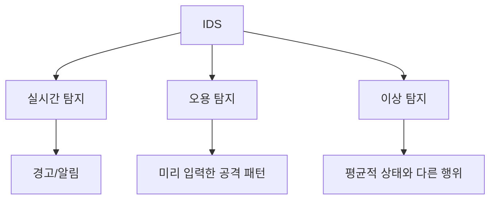
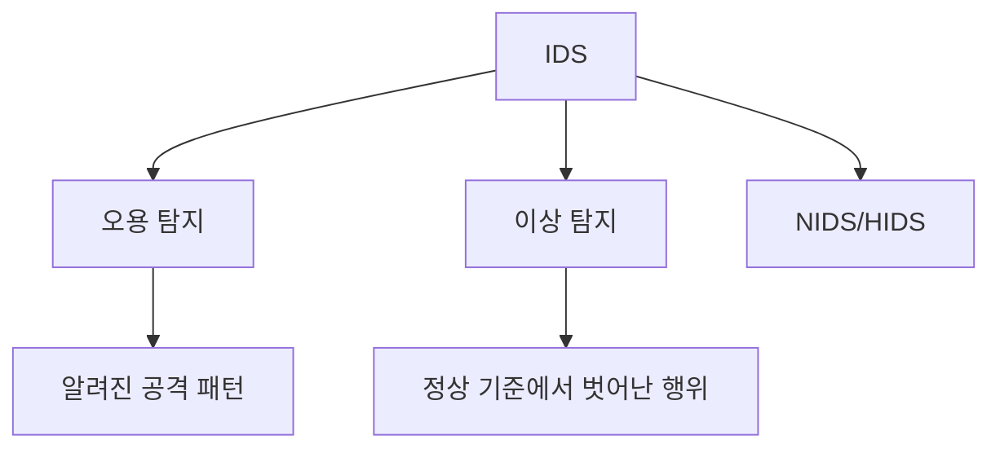

# 322 침입 탐지 시스템(IDS; Intrusion Detection System)

작성 기준일: 2026-06-01
검색/보강일: 2026-06-04
기준 PDF: `/Users/nes0903/Documents/study/정보처리기사/핵심요약집_2026_정보처리기사필기핵심요약.pdf`
PDF 확인 위치: 44페이지 `322 침입 탐지 시스템(IDS; Intrusion Detection System)`

## 한 줄 요약

- IDS는 시스템의 비정상 사용, 오용, 남용을 실시간 탐지하며, 오용 탐지와 이상 탐지 방식으로 구분된다.

## 한눈에 보는 구조

## PDF 기준 핵심

- 컴퓨터 시스템의 비정상적인 사용, 오용, 남용 등을 실시간으로 탐지하는 시스템이다.
- 오용 탐지(Misuse Detection): 미리 입력해 둔 공격 패턴이 감지되면 이를 알려준다.
- 이상 탐지(Anomaly Detection): 평균적인 시스템의 상태를 기준으로 비정상적인 행위나 자원의 사용이 감지되면 이를 알려준다.

## 개념 설명

- IDS는 침입 가능성을 탐지하고 경고하는 시스템이다.
- 네트워크 IDS는 네트워크 트래픽을, 호스트 IDS는 개별 시스템의 로그와 행위를 감시한다.
- NIST의 IDPS 가이드는 IDS와 IPS 기술의 설계, 구성, 운영을 다루며 탐지 방식과 운용 고려사항을 설명한다.
- IPS는 탐지 후 차단까지 수행하는 반면, IDS는 탐지와 알림이 중심이다.

## 시험 포인트

- `실시간 탐지`가 핵심이다.
- 오용 탐지는 알려진 공격 패턴 기반, 이상 탐지는 정상 기준에서 벗어남 기반이다.
- IDS와 IPS를 구분한다. IDS는 탐지, IPS는 방지/차단까지 포함한다.
- DPI는 패킷 내부 분석 기술이고, IDS는 침입 탐지 시스템이다.

## 헷갈리는 비교

| 구분 | 오용 탐지 | 이상 탐지 |
|---|---|---|
| 기준 | 등록된 공격 패턴 | 정상 상태 기준 |
| 장점 | 알려진 공격 탐지 정확 | 새로운 이상 행위 탐지 가능 |
| 약점 | 새로운 공격 취약 | 오탐 가능성 |
| 시험 단서 | Misuse | Anomaly |

## 예시 또는 암기 포인트

- SQL Injection 패턴 문자열이 탐지되어 경고하면 오용 탐지, 평소보다 비정상적으로 많은 로그인 실패가 탐지되면 이상 탐지로 볼 수 있다.
- 암기식: `IDS = Intrusion을 Detect`.

## 빠른 복습

- IDS의 역할은? 침입 실시간 탐지.
- Misuse Detection 기준은? 미리 입력한 공격 패턴.
- Anomaly Detection 기준은? 평균적 시스템 상태.

## 상세 보강

- IDS는 시스템이나 네트워크의 비정상 사용, 오용, 남용을 탐지하고 경고하는 보안 시스템이다.
- 오용 탐지는 알려진 공격 패턴이나 시그니처와 일치하는지를 본다.
- 이상 탐지는 정상 상태 기준선을 만들고 그 기준에서 벗어난 행위를 탐지한다.
- NIDS는 네트워크 트래픽을, HIDS는 호스트 내부 행위를 주로 감시한다.
- 시험에서는 IDS를 방화벽처럼 직접 차단하는 장비로만 보지 않는다. 기본 역할은 탐지이며, IPS는 차단까지 수행하는 개념으로 구분한다.

| 구분 | IDS | IPS |
|---|---|---|
| 기본 역할 | 탐지/경고 | 탐지 후 차단 |
| 위치 | 네트워크/호스트 | 보통 인라인 |
| 단서 | Intrusion Detection | Intrusion Prevention |

## 참고 링크

- [NIST SP 800-94 - Guide to Intrusion Detection and Prevention Systems](https://www.nist.gov/publications/guide-intrusion-detection-and-prevention-systems-idps)
