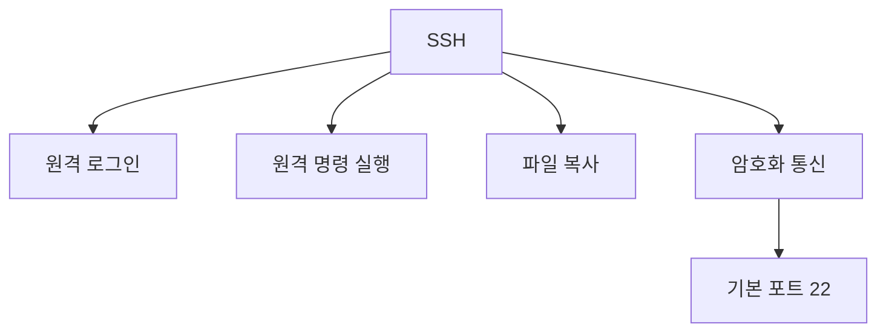
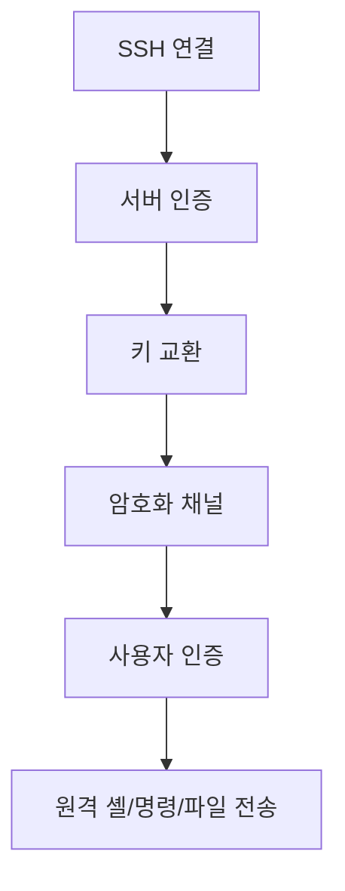

# 324 SSH(Secure SHell, 시큐어 셸)

작성 기준일: 2026-06-01
검색/보강일: 2026-06-04
기준 PDF: `/Users/nes0903/Documents/study/정보처리기사/핵심요약집_2026_정보처리기사필기핵심요약.pdf`
PDF 확인 위치: 45페이지 `324 SSH(Secure SHell, 시큐어 셸)`

## 한 줄 요약

- SSH는 안전하지 않은 네트워크 위에서 원격 로그인, 원격 명령 실행, 파일 복사 등을 안전하게 수행하게 해 주는 프로토콜이자 응용 프로그램이다.

## 한눈에 보는 구조

## PDF 기준 핵심

- 다른 컴퓨터에 로그인, 원격 명령 실행, 파일 복사 등을 수행할 수 있도록 다양한 기능을 지원하는 프로토콜 또는 이를 이용한 응용 프로그램이다.
- 기본적으로는 22번 포트를 사용한다.

## 개념 설명

- SSH(Secure Shell)는 Telnet처럼 원격 접속을 제공하지만 통신을 암호화해 기밀성과 무결성을 보호한다.
- RFC 4251은 SSH를 안전하지 않은 네트워크에서 보안 원격 로그인과 기타 보안 네트워크 서비스를 제공하는 프로토콜로 설명한다.
- SSH는 서버 인증, 사용자 인증, 암호화된 연결, 여러 채널 multiplexing을 제공한다.
- SCP, SFTP, 포트 포워딩 같은 기능도 SSH 기반으로 사용될 수 있다.

## 시험 포인트

- 기본 포트는 `22번`이다.
- `원격 로그인`, `원격 명령 실행`, `파일 복사`를 PDF 그대로 기억한다.
- Telnet과 비교하면 SSH는 암호화된 안전한 원격 접속이다.
- VPN은 네트워크 터널, SSH는 원격 셸/보안 프로토콜 중심이다.

## 헷갈리는 비교

| 구분 | SSH | Telnet | VPN |
|---|---|---|---|
| 목적 | 보안 원격 로그인/명령 | 원격 로그인 | 사설망 터널 |
| 보안 | 암호화 | 평문 전송 위험 | 암호화 터널 |
| 기본 포트 | 22 | 23 | 구현별 다름 |
| 시험 단서 | Secure Shell | Telnet | Virtual Private Network |

## 예시 또는 암기 포인트

- `ssh user@server`로 서버에 접속해 명령을 실행하면 SSH를 사용하는 것이다.
- 암기식: `SSH = Secure Shell, 22번`.

## 빠른 복습

- SSH의 기본 포트는? 22번.
- SSH가 지원하는 기능은? 원격 로그인, 원격 명령 실행, 파일 복사.
- Telnet과 차이는? SSH는 암호화된 보안 접속이다.

## 상세 보강

- SSH는 안전하지 않은 네트워크에서도 암호화된 원격 접속을 제공하는 프로토콜이다.
- 서버 인증과 키 교환을 통해 암호화 채널을 만들고, 그 안에서 사용자 인증과 원격 명령 실행을 수행한다.
- 비밀번호 인증뿐 아니라 공개키 인증을 사용할 수 있어 자동화와 서버 관리에 자주 쓰인다.
- SCP와 SFTP는 SSH 기반으로 파일 전송을 안전하게 수행하는 대표 기능이다.
- 시험에서는 `22번 포트`, `원격 로그인`, `원격 명령 실행`, `파일 복사`, `암호화`를 묶어서 기억한다.

| 구분 | SSH | Telnet |
|---|---|---|
| 포트 | 22 | 23 |
| 보안 | 암호화 | 평문 위험 |
| 기능 | 원격 로그인, 명령, 파일 전송 | 원격 로그인 중심 |

## 참고 링크

- [RFC 4251 - The Secure Shell Protocol Architecture](https://datatracker.ietf.org/doc/html/rfc4251)
- [Microsoft Learn - OpenSSH Server port 22](https://learn.microsoft.com/en-us/troubleshoot/windows-server/system-management-components/troubleshoot-openssh-windows-firewall-port22)
