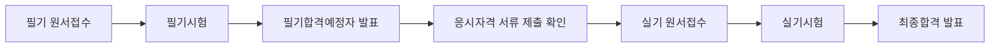
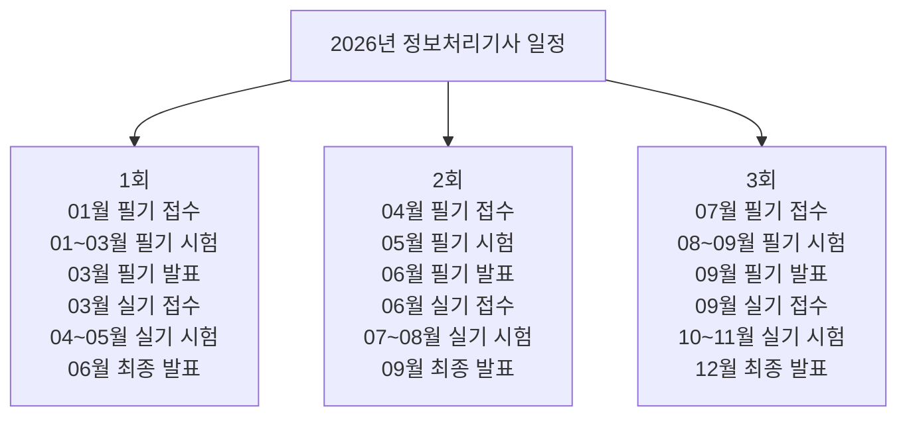

# 정보처리기사 2026 일정 정리

작성 기준일: 2026-04-13  
기준: `Q-Net 정보처리기사 종목 페이지`

## 1. 한 줄 요약

`2026년 정보처리기사`는 `정기 기사 1회, 2회, 3회`로 시행되며, 각 회차마다 `필기 원서접수 -> 필기시험 -> 필기합격 발표 -> 실기 원서접수 -> 실기시험 -> 최종합격 발표` 순서로 진행된다.

---

## 2. 전체 흐름

핵심 포인트:

- `기사 등급`이라 필기 합격 후 `응시자격 서류` 처리도 같이 챙겨야 한다.
- `원서접수 시간`은 접수 첫날 `10:00`부터 마지막 날 `18:00`까지다.
- `합격자 발표 시간`은 발표일 `09:00`이다.

---

## 3. 2026년 정기 기사 1회

### 3.1 일정

- 필기 원서접수: `2026.01.12 ~ 2026.01.15`
- 필기 빈자리접수: `2026.01.24 ~ 2026.01.25`
- 필기시험: `2026.01.30 ~ 2026.03.03`
- 필기합격예정자 발표: `2026.03.11`
- 실기 원서접수: `2026.03.23 ~ 2026.03.26`
- 실기 빈자리접수: `2026.04.12 ~ 2026.04.13`
- 실기시험: `2026.04.18 ~ 2026.05.06`
- 최종합격자 발표: `2026.06.12`

### 3.2 해석

- 1회는 연초에 시작해서 `6월 중순`에 최종 결과가 나온다.
- 상반기 안에 자격 취득 결과를 확보하고 싶은 사람에게 유리하다.

---

## 4. 2026년 정기 기사 2회

### 4.1 일정

- 필기 원서접수: `2026.04.20 ~ 2026.04.23`
- 필기 빈자리접수: `2026.05.03 ~ 2026.05.04`
- 필기시험: `2026.05.09 ~ 2026.05.29`
- 필기합격예정자 발표: `2026.06.10`
- 실기 원서접수: `2026.06.22 ~ 2026.06.25`
- 실기시험: `2026.07.18 ~ 2026.08.05`
- 최종합격자 발표: `2026.09.11`

### 4.2 해석

- 2회는 `봄 접수 -> 여름 시험 -> 9월 결과` 흐름이다.
- 학기 중 준비하거나 여름방학을 실기 집중 기간으로 쓰기 좋다.

---

## 5. 2026년 정기 기사 3회

### 5.1 일정

- 필기 원서접수: `2026.07.20 ~ 2026.07.23`
- 필기시험: `2026.08.07 ~ 2026.09.01`
- 필기합격예정자 발표: `2026.09.09`
- 실기 원서접수: `2026.09.21 ~ 2026.09.28`
- 실기시험: `2026.10.24 ~ 2026.11.13`
- 최종합격자 발표: `2026.12.18`

### 5.2 해석

- 3회는 하반기 마감 회차에 가깝다.
- 연내 취득은 가능하지만, 실기까지 밀리면 체감상 일정 압박이 있을 수 있다.

---

## 6. 회차별 한눈에 비교

| 회차 | 필기 접수 | 필기 시험 | 필기 발표 | 실기 접수 | 실기 시험 | 최종 발표 |
|---|---|---|---|---|---|---|
| 1회 | 01.12 ~ 01.15 | 01.30 ~ 03.03 | 03.11 | 03.23 ~ 03.26 | 04.18 ~ 05.06 | 06.12 |
| 2회 | 04.20 ~ 04.23 | 05.09 ~ 05.29 | 06.10 | 06.22 ~ 06.25 | 07.18 ~ 08.05 | 09.11 |
| 3회 | 07.20 ~ 07.23 | 08.07 ~ 09.01 | 09.09 | 09.21 ~ 09.28 | 10.24 ~ 11.13 | 12.18 |

---

## 7. 준비 관점에서 보면

### 7.1 1회가 좋은 경우

- 상반기 안에 자격 취득 결과가 필요할 때
- 겨울방학이나 연초 시간을 길게 쓸 수 있을 때

### 7.2 2회가 좋은 경우

- 학기 중 필기 준비 후 여름에 실기 집중이 가능할 때
- 가장 무난한 회차로 가져가고 싶을 때

### 7.3 3회가 좋은 경우

- 상반기 준비가 늦었을 때
- 하반기 몰아서 정리할 수 있을 때

단, 3회는 연말 발표라서:

- 한 번에 끝내지 못하면 다음 해로 넘어갈 가능성도 생각해야 한다.

---

## 8. 일정 해석 시 주의사항

- `지역별·시험장별` 세부 일정은 다를 수 있다.
- `빈자리접수` 일정은 일반 접수와 다르므로 따로 확인해야 한다.
- 회차별로 공지되는 `수험자 안내`를 반드시 같이 봐야 한다.
- 응시자격 제한 종목이므로 `필기 합격 후 서류 제출` 일정도 같이 관리해야 한다.

즉, 달력에 적을 때는 아래 3개를 같이 적는 것이 좋다.

- 접수 마감일
- 필기합격 발표일
- 실기접수 시작일

---

## 9. 빠른 일정 플로우

---

## 10. 요약

- `2026년 정보처리기사`는 `1회, 2회, 3회`로 시행된다.
- `1회 최종 발표`는 `2026.06.12`
- `2회 최종 발표`는 `2026.09.11`
- `3회 최종 발표`는 `2026.12.18`
- 가장 중요한 운영 포인트는 `접수 마감`, `필기 발표`, `실기 접수`, `응시자격 서류`다.

---

## 11. 참고 링크

- Q-Net 정보처리기사 종목 페이지: [시험일정 / 수수료 / 시험정보](https://www.q-net.or.kr/crf005.do?id=crf00503s02&jmCd=1320&jmInfoDivCcd=B0)
- Q-Net 원서접수 안내: [원서접수 시간 및 수험자 안내](https://www.q-net.or.kr/rcv001.do?gSite=Q&id=rcv00103)
- Q-Net 필기시험 안내: [기사·산업기사 시험시간 및 서류 관련 안내](https://mo.q-net.or.kr/rcv001.do?gSite=Q&id=rcv00104)
