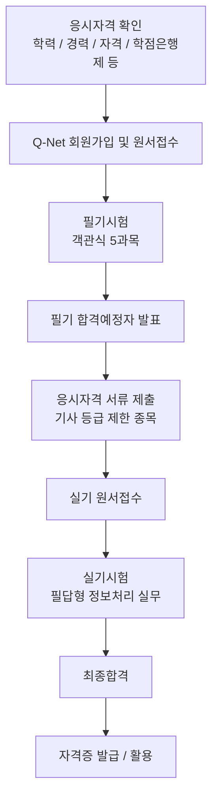
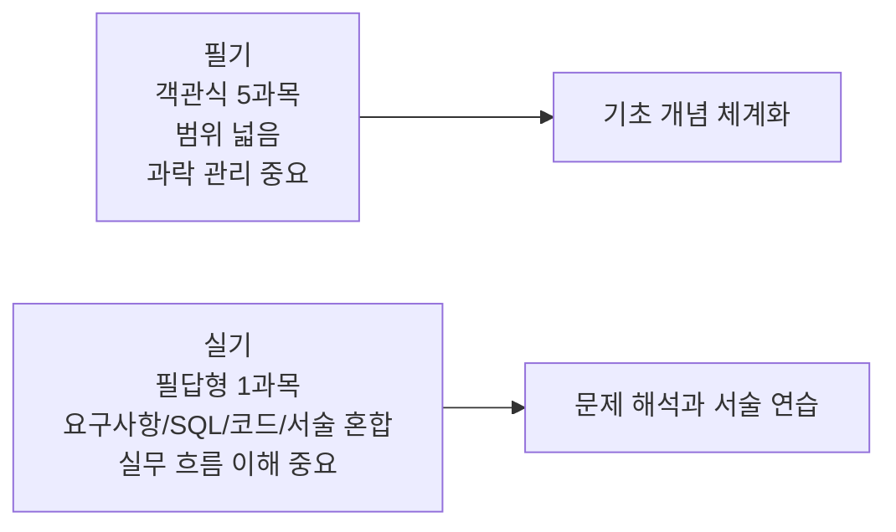
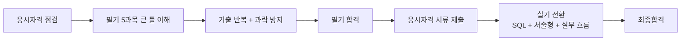

# 정보처리기사 상세 정리

작성 기준일: 2026-04-13  
주요 참고: `Q-Net(한국산업인력공단)` 공식 페이지

## 1. 한 줄 요약

`정보처리기사`는 한국산업인력공단이 시행하는 국가기술자격 기사 등급 시험으로, 소프트웨어 설계·개발·데이터베이스·프로그래밍 언어 활용·정보시스템 구축관리 전반의 기본 역량을 검증하는 대표적인 IT 자격시험이다.

짧게 말하면:

- 한국에서 가장 인지도가 높은 IT 국가기술자격 중 하나이고
- 개발, 전산, 공공기관 전산직, SI/SM, 시스템 운영, DB, QA, 보안 기초 역량과 맞닿아 있으며
- `필기 + 실기` 두 단계로 합격해야 최종 취득할 수 있다.

---

## 2. 먼저 전체 흐름부터 보기

아래 Mermaid는 정보처리기사 시험을 준비할 때 가장 먼저 이해해야 할 전체 구조를 한눈에 보여준다.

이 흐름에서 가장 중요한 포인트는 두 가지다.

- `응시자격 제한`이 있는 기사 시험이라는 점
- `필기 합격만으로 끝나지 않고`, 서류 심사와 실기까지 통과해야 한다는 점

---

## 3. 정보처리기사는 정확히 어떤 시험인가

Q-Net의 `취득방법` 페이지 기준 정보처리기사는 아래처럼 정리된다.

- 시행처: `한국산업인력공단`
- 관련학과: `모든 학과 응시가능`
- 필기 과목:
  - 소프트웨어설계
  - 소프트웨어개발
  - 데이터베이스구축
  - 프로그래밍언어활용
  - 정보시스템구축관리
- 실기 과목: `정보처리 실무`
- 검정방법:
  - 필기: 객관식 4지 택일형, 과목당 20문항, 과목당 30분
  - 실기: 필답형, 2시간 30분
- 합격기준:
  - 필기: 과목당 40점 이상 + 전과목 평균 60점 이상
  - 실기: 60점 이상

여기서 특히 중요한 점은 `모든 학과 응시가능`이라는 표현이다.

이 말은:

- 정보처리기사라는 종목 자체가 특정 전공 전용으로 제한된 것은 아니라는 뜻이지
- 누구나 무조건 응시 가능하다는 뜻은 아니다.

즉, `기사 등급 시험 전체의 응시자격 규정`은 그대로 적용된다.

---

## 4. 왜 많은 사람이 정보처리기사를 준비하나

정보처리기사가 널리 알려진 이유는 단순히 "국가자격증"이라서가 아니다.

### 4.1 IT 직무 전반과 접점이 넓다

시험 범위가 매우 실무적인 편이다.

예:

- 요구사항 분석
- 소프트웨어 설계
- 구현
- 테스트
- 데이터베이스
- SQL
- 보안
- 운영체제/네트워크/개발환경

즉 특정 세부 직무 하나보다 `IT 시스템 전체 흐름`을 본다.

### 4.2 공공기관·공기업·전산직과 연결된다

한국 취업 시장에서 국가기술자격은 특히:

- 공공기관 전산직
- 공기업
- 일부 공무원 가산점/우대 영역
- 공공 SI/SM

과의 접점이 크다.

### 4.3 비전공자에게도 구조적 학습 틀이 된다

비전공자가 독학할 때도 정보처리기사 범위는:

- CS 기초
- 개발 프로세스
- 데이터베이스
- 정보보안 기초

를 한 번에 훑는 골격 역할을 한다.

즉 이 시험은 단순 암기 시험이 아니라, 한국식 IT 실무/기초 학습의 표준적인 입문 틀로 작동하기도 한다.

---

## 5. 응시자격: 가장 먼저 확인해야 하는 것

기사 시험은 `응시자격 제한 종목`이다.

Q-Net `응시자격서류안내`와 `응시자격별 안내` 기준으로, 기사 응시자격은 대체로 아래 경로 중 하나로 충족한다.

### 5.1 대표적인 기사 응시자격 경로

Q-Net 공식 안내를 실무적으로 정리하면 다음이 가장 자주 쓰이는 경로다.

1. `기사 자격 취득자`
2. `산업기사 취득 후 1년 이상 실무경력`
3. `기능사 취득 후 3년 이상 실무경력`
4. `4년제 대학 졸업자 또는 졸업예정자`
5. `전문대 졸업 후 2년 이상 실무경력`
6. `4년 이상 실무경력`
7. `기사 수준 교육훈련기관 이수자`
8. `산업기사 수준 교육훈련기관 이수 후 2년 실무`
9. `학점인정 등에 관한 법률에 따른 106학점 이상 취득자`
10. `외국 동일 등급 자격 취득자`
11. `학점은행제 전문대학 졸업 동등 학력 + 2년 실무경력`

### 5.2 정보처리기사에서 사람들이 자주 해당하는 케이스

현실적으로는 아래 몇 가지가 가장 많다.

- 4년제 대학 졸업(예정)
- 학점은행제 106학점 이상
- 관련 실무경력 4년
- 산업기사 + 실무경력

### 5.3 "모든 학과 응시가능"의 정확한 의미

이 문구 때문에 오해가 많다.

정확한 해석은 다음이다.

- 특정 학과만 허용되는 종목은 아니다
- 하지만 기사 등급 공통 응시자격은 필요하다

즉:

- 4년제 인문계열 졸업자도 응시 가능할 수 있다
- 다만 기사 등급 응시자격을 충족해야 한다

### 5.4 응시자격 자가진단은 꼭 해보는 것이 좋다

Q-Net에는 `응시자격 자가진단`이 있다.

특히 경력, 학점은행제, 수료 기준이 애매한 경우:

- 접수 전에 자가진단
- 필요한 서류 확인

을 하는 것이 안전하다.

### 5.5 가장 중요한 기준일

Q-Net `응시자격서류안내` 기준, 기사 응시자격 심사 기준일은 기본적으로 `필기시험일`이다.

즉:

- 원서접수일이 아니라
- 해당 회차의 필기시험일 기준으로 자격을 충족해야 한다

이 점은 졸업예정, 경력 산정, 학점 취득 마감 계산에서 매우 중요하다.

---

## 6. 응시자격 서류 제출: 자주 놓치는 포인트

기사 시험은 `필기 합격예정자 발표 후` 서류를 내야 하는 구조가 핵심이다.

Q-Net 안내 기준:

- 기사/산업기사/기술사/기능장 등 응시자격 제한 종목은
- 필기시험 합격예정자 발표일로부터 `8일 이내(토·공휴일 제외)`에
- 응시자격 서류를 제출해야 한다

이걸 놓치면:

- 필기 점수가 합격이어도
- 합격예정이 무효 처리될 수 있다

### 6.1 실기 접수와의 관계

공식 안내에 따르면:

- 응시자격서류 제출 후 합격처리된 사람만 실기접수가 가능하다

즉:

- 필기 합격
- 서류 심사 통과
- 그 다음 실기 접수

순서가 된다.

### 6.2 어떤 서류가 자주 필요한가

대표적으로:

- 졸업증명서
- 졸업예정증명서
- 수료(휴학)증명서
- 경력(재직)증명서
- 학점인정 증명서

### 6.3 서류 관련 실수

자주 생기는 실수는 아래다.

- 경력증명서 업무 내용이 너무 모호함
- 기준일까지 경력/학점이 충족되지 않음
- 서류 제출 기간을 놓침
- 온라인/우편/방문 제출 방식 착오

즉 정보처리기사는 시험 공부만큼 `행정 실수 방지`가 중요하다.

---

## 7. 필기시험 구조

정보처리기사 필기는 5과목으로 구성된다.

1. 소프트웨어설계
2. 소프트웨어개발
3. 데이터베이스구축
4. 프로그래밍언어활용
5. 정보시스템구축관리

### 7.1 문제 수와 시간

공식 기준:

- 과목당 20문항
- 과목당 30분

따라서 전체는:

- `총 100문항`
- `총 150분`

구조라고 이해하면 된다.

### 7.2 문제 형식

- 객관식 4지 택일형

### 7.3 합격 기준

필기는 아래 두 조건을 동시에 만족해야 한다.

- 각 과목 `40점 이상`
- 전 과목 평균 `60점 이상`

즉 평균만 높아도 과락이 있으면 떨어진다.

### 7.4 과락이 중요한 이유

예를 들어:

- 4과목을 잘 봐서 평균 70점이 나와도
- 1과목이 35점이면

불합격이다.

그래서 정보처리기사 필기 전략은:

- 특정 과목 몰빵

보다

- 전 과목 하한선 확보

가 중요하다.

---

## 8. 필기 과목별 의미

공식 과목명만 보면 막연할 수 있어서, 각 과목이 무엇을 보는지 실무적으로 풀어보면 다음과 같다.

### 8.1 소프트웨어설계

핵심 주제:

- 요구사항 분석
- UML/모델링
- 화면설계
- 인터페이스 설계
- 애플리케이션 아키텍처
- 객체지향 설계

즉 "무엇을 만들지, 어떻게 구조화할지"를 본다.

### 8.2 소프트웨어개발

핵심 주제:

- 구현
- 테스트
- 통합
- 형상관리
- 개발 방법론
- 개발 보안 기초

즉 실제 개발 lifecycle의 중간~후반부를 본다.

### 8.3 데이터베이스구축

핵심 주제:

- 데이터 모델링
- 정규화
- 관계형 데이터베이스 개념
- SQL
- DB 설계/운영 기초

정보처리기사에서 체감 난도가 꽤 높은 파트 중 하나다.

### 8.4 프로그래밍언어활용

핵심 주제:

- 언어 기본 문법
- 제어문
- 배열/포인터/객체 개념
- 언어별 문법 문제

실무 개발자에게는 상대적으로 익숙하지만, 비전공자에게는 부담이 될 수 있다.

### 8.5 정보시스템구축관리

핵심 주제:

- 운영체제
- 네트워크
- 보안
- IT 프로젝트 관리
- 시스템 구축/운영 관리

즉 인프라/운영/보안/관리 영역의 기초를 보는 과목이다.

---

## 9. 필기시험은 CBT로 이해하는 것이 맞는가

Q-Net에는 `필기 기사/산업기사 CBT 자격시험 체험하기` 페이지가 제공된다.

이 점을 근거로 보면, 현재 기사/산업기사 필기시험은 `CBT 환경 이해`가 중요하다고 보는 것이 맞다.

다만 지역/회차/운영 방식 관련 세부 안내는 공식 공지사항과 수험자 안내를 반드시 같이 봐야 한다.

실전적으로는 아래를 이해하고 가면 된다.

- 컴퓨터 기반 시험 화면에 익숙해질 것
- 체크 표시, 남은 문제 보기, 문제 이동 방식 숙지
- 시간 배분 감각을 미리 익힐 것

즉 `기출을 푸는 것`만큼 `CBT 환경에 익숙해지는 것`도 중요하다.

---

## 10. 실기시험 구조

실기는 공식적으로 `정보처리 실무` 한 과목이다.

형식:

- `필답형`
- 시험시간 `2시간 30분`

합격 기준:

- `100점 만점 중 60점 이상`

즉 실기는 객관식이 아니라, 답을 직접 쓰는 서술/계산/작성형 중심이라고 이해해야 한다.

---

## 11. 실기 출제 경향: 공식 Q-Net 기준

Q-Net `출제경향` 페이지에는 실기시험 출제 경향이 비교적 구체적으로 나와 있다.

요지를 정리하면 실기는 정보시스템 개발 요구사항을 이해하고, 업무에 맞는 소프트웨어의 설계·구현·테스트를 수행하는 능력을 본다.

공식 페이지에 제시된 실기 출제 경향의 큰 항목은 다음과 같다.

1. 현행 시스템 분석 및 요구사항 확인
2. 데이터 입출력 구현
3. 통합 구현
4. 서버프로그램 구현
5. 인터페이스 구현
6. 화면설계
7. 애플리케이션 테스트
8. SQL 응용
9. 소프트웨어 개발 보안 구축
10. 프로그래밍 언어 활용
11. 응용 SW 기초 기술 활용
12. 제품 소프트웨어 패키징

이걸 보면 실기의 본질이 드러난다.

- 단순 암기 서술 시험이 아니라
- `요구사항 -> 설계 -> 구현 -> 테스트 -> SQL -> 보안 -> 운영 기초`

까지 이어지는 실무 흐름을 본다.

---

## 12. 필기와 실기의 차이

정보처리기사는 필기와 실기가 성격이 꽤 다르다.

### 12.1 필기의 성격

- 넓은 범위
- 객관식
- 기출과 개념 반복의 비중이 큼

### 12.2 실기의 성격

- 서술형/작성형 대응이 중요
- SQL, 용어, 설계, 코드, 절차 이해를 묻는다
- "보기 중 고르기"가 아니라 "정확히 써내기"가 필요하다

즉 많은 수험생이 느끼는 체감은:

- 필기: 범위가 넓다
- 실기: 깊이와 정확도가 요구된다

이다.

---

## 13. 2026년 시험 일정

Q-Net 정보처리기사 종목 페이지 기준, `2026-04-13` 시점에 확인되는 `2026년 정기 기사` 일정은 다음과 같다.

### 13.1 2026년 정기 기사 1회

- 필기 원서접수: `2026.01.12 ~ 2026.01.15`
- 필기 빈자리접수: `2026.01.24 ~ 2026.01.25`
- 필기시험: `2026.01.30 ~ 2026.03.03`
- 필기합격 발표: `2026.03.11`
- 실기 원서접수: `2026.03.23 ~ 2026.03.26`
- 실기 빈자리접수: `2026.04.12 ~ 2026.04.13`
- 실기시험: `2026.04.18 ~ 2026.05.06`
- 최종합격 발표: `2026.06.12`

### 13.2 2026년 정기 기사 2회

- 필기 원서접수: `2026.04.20 ~ 2026.04.23`
- 필기 빈자리접수: `2026.05.03 ~ 2026.05.04`
- 필기시험: `2026.05.09 ~ 2026.05.29`
- 필기합격 발표: `2026.06.10`
- 실기 원서접수: `2026.06.22 ~ 2026.06.25`
- 실기시험: `2026.07.18 ~ 2026.08.05`
- 최종합격 발표: `2026.09.11`

### 13.3 2026년 정기 기사 3회

- 필기 원서접수: `2026.07.20 ~ 2026.07.23`
- 필기시험: `2026.08.07 ~ 2026.09.01`
- 필기합격 발표: `2026.09.09`
- 실기 원서접수: `2026.09.21 ~ 2026.09.28`
- 실기시험: `2026.10.24 ~ 2026.11.13`
- 최종합격 발표: `2026.12.18`

### 13.4 일정 해석 시 주의점

Q-Net 종목 페이지의 공식 주의사항도 중요하다.

- 원서접수시간은 첫날 `10:00`부터 마지막 날 `18:00`까지
- 발표시간은 해당 발표일 `09:00`
- 지역별/종목별 일정이 다를 수 있음
- `해당 회별 수험자 안내 공지`를 반드시 봐야 함

즉 위 일정은 뼈대 일정이고, 실제 시험장/세부 운영은 회차 공지를 확인해야 한다.

---

## 14. 수수료

Q-Net 종목 페이지 기준 수수료는 다음과 같다.

- 필기: `19,400원`
- 실기: `22,600원`

금액 자체는 크지 않지만, 반복 응시와 교재/강의 비용까지 합치면 총 준비비용은 더 커질 수 있다.

---

## 15. 원서접수와 응시 흐름

Q-Net의 `원서접수안내`, `필기시험안내`, 종목 페이지를 종합하면 실제 수험 흐름은 대체로 아래와 같다.

### 15.1 접수 전

- Q-Net 회원가입
- 사진 등록
- 응시자격 자가진단
- 필요 시 학력/경력/학점 자료 점검

### 15.2 필기 접수

- 접수 기간에 인터넷 원서접수
- 시험장 선택
- 수험표 확인

### 15.3 필기 응시

- 신분증
- 수험표
- 시험 유의사항 숙지

### 15.4 필기 합격예정자 발표

- 점수 확인
- 응시자격서류 제출 대상 여부 확인

### 15.5 응시자격서류 제출

- 기간 내 미제출 시 합격예정 무효 가능

### 15.6 실기 접수

- 서류 반영 후 실기 원서접수

### 15.7 실기 응시 및 최종합격

- 필답형 대비
- 최종 발표 후 자격증 발급 진행

---

## 16. 공부할 때 자주 느끼는 난점

정보처리기사는 겉보기보다 범위가 넓다.

### 16.1 필기의 난점

- 과목이 5개라 범위가 넓다
- 전공자에게는 익숙한데 비전공자에게는 낯선 용어가 많다
- 과락 관리가 중요하다

### 16.2 실기의 난점

- 객관식이 아니라서 `애매하게 아는 것`이 잘 안 통한다
- SQL, 약어, 설계, 절차를 직접 써야 한다
- 문제에서 무엇을 묻는지 해석력이 중요하다

### 16.3 행정적인 난점

- 응시자격 판단
- 서류 제출
- 접수 기간 관리

즉 정보처리기사는 `시험 + 행정`을 같이 관리해야 한다.

---

## 17. 과목별 공부 포인트

아래는 시험 범위를 실전적으로 바라봤을 때의 포인트다.

### 17.1 소프트웨어설계

중점:

- 요구사항 도출/분석
- UML/다이어그램 구분
- 설계 원칙
- 아키텍처/인터페이스

공부 포인트:

- 용어를 암기만 하지 말고 연결해서 이해해야 한다
- 설계 단계 흐름을 이야기처럼 이해하는 것이 좋다

### 17.2 소프트웨어개발

중점:

- 개발 방법론
- 테스트
- 통합
- 형상관리

공부 포인트:

- 순서를 묻는 문제
- 개념 차이(단위/통합/시스템 테스트 등)
- 보안/품질 관련 기본기

### 17.3 데이터베이스구축

중점:

- ERD
- 정규화
- 무결성
- SQL

공부 포인트:

- 개념 + SQL 문법 둘 다 필요
- 실기까지 이어지므로 암기보다 손으로 써보는 연습이 중요

### 17.4 프로그래밍언어활용

중점:

- 언어 문법
- 제어문
- 자료형
- 기본 코드 해석

공부 포인트:

- "눈으로만 읽는 것"보다 직접 코드 흐름을 추적하는 연습이 필요

### 17.5 정보시스템구축관리

중점:

- 운영체제
- 네트워크
- 보안
- 프로젝트 관리

공부 포인트:

- 약어, 개념 비교 문제가 자주 부담이 된다
- 외워야 하는 부분과 구조를 이해해야 하는 부분을 나눠야 한다

---

## 18. 실기 공부 포인트

Q-Net 공식 출제경향을 기준으로 보면 실기는 생각보다 `개발 실무 전 과정`을 묻는다.

### 18.1 SQL은 거의 필수 축이다

실기 공식 출제경향에도 `SQL 응용`이 별도 항목으로 들어간다.

즉 실기를 준비한다면:

- SELECT
- JOIN
- GROUP BY
- 서브쿼리
- INSERT / UPDATE / DELETE
- DDL / DCL / TCL 기본

은 반드시 손으로 써보며 익혀야 한다.

### 18.2 요구사항 -> 설계 -> 구현 흐름 이해가 중요하다

실기 공식 항목을 보면:

- 현행 시스템 분석
- 데이터 입출력
- 통합 구현
- 서버프로그램 구현
- 인터페이스 구현
- 화면설계
- 테스트

가 이어진다.

즉 문제를 조각 암기로 풀기보다 `개발 프로젝트 흐름`으로 묶어서 이해하는 게 유리하다.

### 18.3 약어와 용어 정확도가 필요하다

필답형은:

- "대충 이런 뜻"으로는 점수를 주기 어렵다

그래서:

- 정확한 용어
- 표준 정의
- 차이점 서술

연습이 필요하다.

### 18.4 코드/알고리즘 감각도 필요하다

공식 출제경향에 `프로그래밍 언어 활용`이 들어 있으므로:

- 아주 깊은 코딩 테스트 수준까지는 아니더라도
- 기본 문법과 흐름을 읽고 쓰는 능력

이 있어야 한다.

---

## 19. 공부 순서 추천

정보처리기사를 처음 준비한다면 아래 순서가 효율적이다.

### 19.1 1단계: 시험 구조를 이해

- 응시자격
- 필기/실기 구조
- 과락 기준
- 일정

이걸 먼저 알아야 한다.

### 19.2 2단계: 필기 5과목의 큰 틀 잡기

각 과목을 세세하게 파기 전에:

- 과목이 뭘 다루는지
- 어떻게 연결되는지

큰 지도를 먼저 보는 게 좋다.

### 19.3 3단계: 기출 중심 반복

정보처리기사는 기출 체감이 강한 편이라:

- 반복 출제되는 용어
- 자주 나오는 개념 차이
- SQL 유형

를 빨리 익히는 것이 중요하다.

### 19.4 4단계: 실기 전환

필기 합격 후가 아니라, 가능하면 필기 공부 후반부터 실기를 병행하는 편이 좋다.

왜냐하면:

- SQL
- 설계/테스트 용어
- 보안 기초

는 필기·실기 공통축이 많기 때문이다.

### 19.5 5단계: 서술형 답안 연습

실기는 결국 써내야 한다.

따라서:

- 키워드 정리
- 서술 패턴 정리
- SQL 직접 작성

연습이 필요하다.

---

## 20. 비전공자에게는 어떻게 접근하는 게 좋은가

비전공자에게 정보처리기사는 충분히 가능하지만 접근 순서가 중요하다.

### 20.1 용어 사전을 먼저 만든다

처음엔 용어가 너무 많다.

따라서:

- 요구사항
- UML
- 정규화
- 무결성
- 트랜잭션
- 테스트 종류
- 공격 기법

같은 핵심 용어를 짧게 정리한 개인 사전을 먼저 만드는 게 좋다.

### 20.2 개발 lifecycle로 묶어 이해한다

각 과목을 따로 외우면 힘들다.

오히려:

- 요구사항 분석
- 설계
- 구현
- 테스트
- 배포/운영
- 보안/관리

라는 흐름으로 묶으면 훨씬 이해가 쉽다.

### 20.3 SQL은 따로 시간을 투자해야 한다

비전공자는 SQL에서 많이 막힌다.

그래서:

- 필기용 개념
- 실기용 작성 능력

둘을 같이 준비하는 게 좋다.

---

## 21. 전공자에게는 어떻게 접근하는 게 좋은가

전공자도 정보처리기사를 만만하게 보면 안 된다.

### 21.1 실무자/전공자의 흔한 함정

- "대충 알지" 하고 용어를 정확히 안 외움
- 객관식은 맞는데 필답형에서 서술이 흐릿함
- 프로젝트관리/보안/운영체제 파트를 소홀히 함

### 21.2 전공자의 전략

- 기초 CS는 빠르게 훑고
- 시험식 표현과 서술형 답안 포맷에 익숙해지는 것이 중요하다

즉 전공자는 "모른다"보다 "시험 식으로 정확히 쓰지 못한다"가 더 큰 문제인 경우가 많다.

---

## 22. 준비 일정은 어떻게 잡는 게 좋은가

### 22.1 짧게 준비하는 경우

이미 CS/개발 지식이 있는 경우:

- 필기 기출 반복
- 실기 SQL/서술형 집중

으로 압축 가능하다.

### 22.2 길게 준비하는 경우

비전공자나 기초가 약한 경우:

- 응시자격/행정 체크
- 개념 지도 만들기
- 과목별 기초
- 기출 반복
- 실기 서술형

순으로 단계화하는 것이 좋다.

### 22.3 회차 선택

2026년 기준 연 `3회` 있으므로, 보통은:

- 필기 준비가 충분히 된 회차를 먼저 선택
- 필기 직후 실기로 바로 이어질 수 있는 시간 여유

를 같이 봐야 한다.

즉 "빨리 치는 것"보다 "필기 후 실기까지 끊기지 않는 회차"가 더 중요할 수 있다.

---

## 23. 정보처리기사 준비 시 자주 묻는 질문

### 23.1 비전공자도 가능한가

가능하다.

다만:

- 응시자격 충족 여부와
- 시험 범위 이해 방식

을 따로 관리해야 한다.

### 23.2 개발자에게도 의미가 있는가

있다.

특히:

- 공공/공기업/전산직
- SI/SM
- 자격 우대 공고

와 연결될 때 활용도가 높다.

### 23.3 가장 어려운 부분은 무엇인가

사람마다 다르지만 대체로:

- 필기 과락 방지
- 실기 SQL
- 서술형 정확도
- 응시자격 서류 관리

가 주요 난점이다.

### 23.4 필기만 붙고 실기는 많이 떨어지나

일반적으로 수험 체감상 실기가 더 어렵다고 느끼는 경우가 많다.

이유:

- 필답형
- 서술형
- 정확한 용어 요구
- SQL/설계/코드 혼합

때문이다.

즉 필기 합격이 끝이 아니라, 실기 전략이 따로 필요하다.

---

## 24. 공부 자료를 볼 때 주의할 점

정보처리기사는 개정 이후 기출 경향이 달라졌고, 해설 품질 차이가 크다.

따라서 자료를 볼 때는:

- 최신 출제기준 반영 여부
- 실기 필답형 반영 여부
- Q-Net 공식 과목명/출제경향과의 일치 여부

를 체크해야 한다.

특히 오래된 자료는:

- 시험 형식
- 범위
- 실기 유형

이 현재와 다를 수 있다.

---

## 25. 실전 운영 체크리스트

시험 준비와 별도로 꼭 챙겨야 할 운영 체크리스트다.

### 25.1 접수 전

- 응시자격 자가진단
- 사진 등록
- 신분증 확인
- 시험 회차 결정

### 25.2 필기 전

- CBT 환경 익히기
- 과락 위험 과목 보완
- 수험표 확인

### 25.3 필기 합격 후

- 서류 제출 대상 여부 확인
- 제출 마감일 확인
- 실기 접수 일정 확인

### 25.4 실기 전

- SQL 작성 연습
- 서술형 키워드 정리
- 실무 흐름 정리

즉 공부와 행정 관리를 따로 체크리스트로 관리하는 것이 좋다.

---

## 26. 한눈에 보는 준비 전략

핵심은 다음이다.

- `필기`는 전 범위 하한선 확보
- `실기`는 정확한 서술과 SQL
- `행정`은 서류 제출/접수 일정 관리

---

## 27. 요약

정보처리기사는 다음처럼 정리할 수 있다.

1. 한국의 대표적인 IT 국가기술자격 기사 시험이다.
2. 필기 5과목 + 실기 1과목 구조다.
3. 기사 등급이므로 응시자격 제한이 있다.
4. 필기 합격 후 응시자격서류 제출을 놓치면 실기까지 못 갈 수 있다.
5. 필기는 과락 관리, 실기는 SQL·서술형·실무 흐름 이해가 핵심이다.
6. 2026년 기준 정기 기사 시험은 1회, 2회, 3회로 시행된다.

즉 정보처리기사는:

- IT 전반 기본기를 검증하는 시험이면서
- 행정 실수 없이 준비해야 하는 `운영형 시험`

이라고 보는 게 가장 정확하다.

---

## 28. 참고 링크

- Q-Net 정보처리기사 종목 페이지: [시험일정 / 수수료 / 취득방법 / 출제경향](https://www.q-net.or.kr/crf005.do?id=crf00503s02&jmCd=1320&jmInfoDivCcd=B0)
- Q-Net 응시자격서류안내: [기사 응시자격 서류와 기준일](https://www.q-net.or.kr/inf/inf04_0120_p.htm)
- Q-Net 응시자격별 안내: [기사 등급 응시자격](https://www.q-net.or.kr/crf006.do?gSite=Q&id=crf00603&tabIdx=2)
- Q-Net 원서접수안내: [접수 및 서류 관련 유의사항](https://www.q-net.or.kr/rcv001.do?gSite=Q&id=rcv00103)
- Q-Net 필기시험안내: [기사·산업기사 시험시간 및 서류 제출](https://mo.q-net.or.kr/rcv001.do?gSite=Q&id=rcv00104)
- Q-Net CBT 체험하기: [기사/산업기사 CBT 체험](https://www.q-net.or.kr/man001.do?gSite=Q&id=man00801&step=1)
- Q-Net 출제기준 자료실(2023~2025): [정보처리기사 출제기준](https://www.q-net.or.kr/cst006.do?artlSeq=5210765&brdId=Q006&code=1202&gId=&gSite=Q&id=cst00602)

<!-- study-links:start -->
## 관련 문서

- `소프트웨어 패키징`: [[정보처리기사/2과목 소프트웨어 개발/073 소프트웨어 패키징/073 소프트웨어 패키징|073 소프트웨어 패키징]]
- `요구사항 분석`: [[정보처리기사/1과목 소프트웨어 설계/009 요구사항 분석/009 요구사항 분석|009 요구사항 분석]]
- `트랜잭션`: [[ACID-트랜잭션/ACID-트랜잭션|ACID 트랜잭션 상세 정리]]
- `join`: [[정보처리기사/3과목 데이터베이스 구축/119 순수 관계 연산자 - Join/119 순수 관계 연산자 - Join|119 순수 관계 연산자 - Join]]
- `sql`: [[sql-query/sql-query|반드시 알아둬야 할 SQL 쿼리 정리]]
- `uml`: [[정보처리기사/1과목 소프트웨어 설계/013 UML/013 UML|013 UML]]
- `무결성`: [[정보처리기사/3과목 데이터베이스 구축/115 무결성/115 무결성|115 무결성]]
- `정규화`: [[정보처리기사/3과목 데이터베이스 구축/123 정규화(Normalization)/123 정규화(Normalization)|123 정규화(Normalization)]]
- `ddl`: [[정보처리기사/3과목 데이터베이스 구축/143 DDL(데이터 정의어)/143 DDL(데이터 정의어)|143 DDL(데이터 정의어)]]
- `dcl`: [[정보처리기사/3과목 데이터베이스 구축/145 DCL(데이터 제어어)/145 DCL(데이터 제어어)|145 DCL(데이터 제어어)]]
<!-- study-links:end -->
